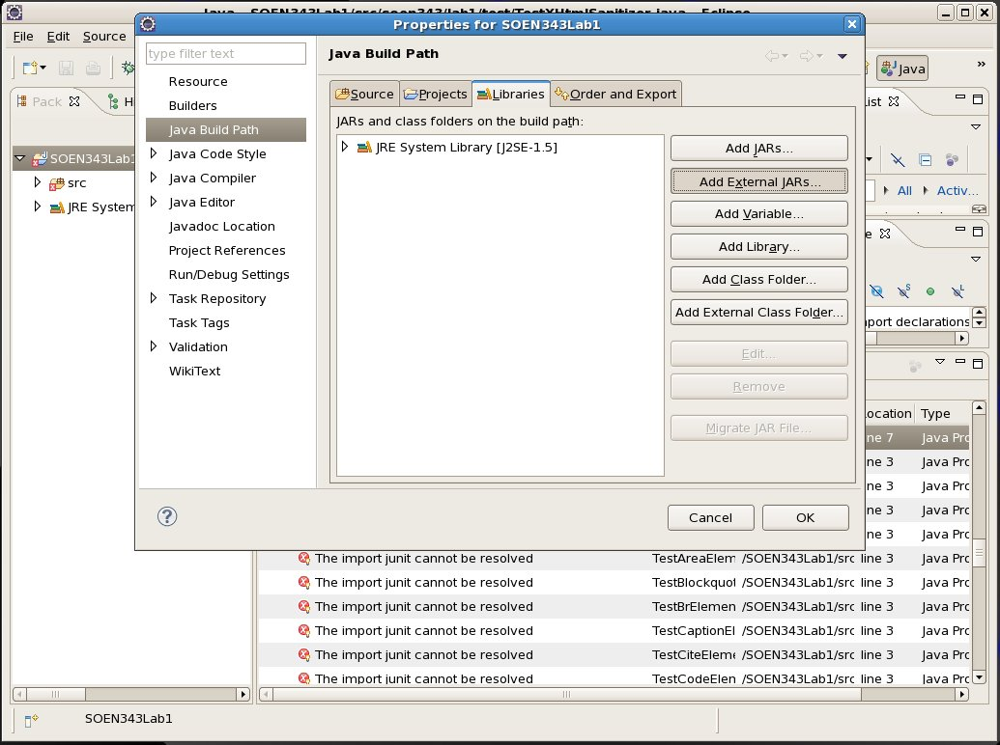
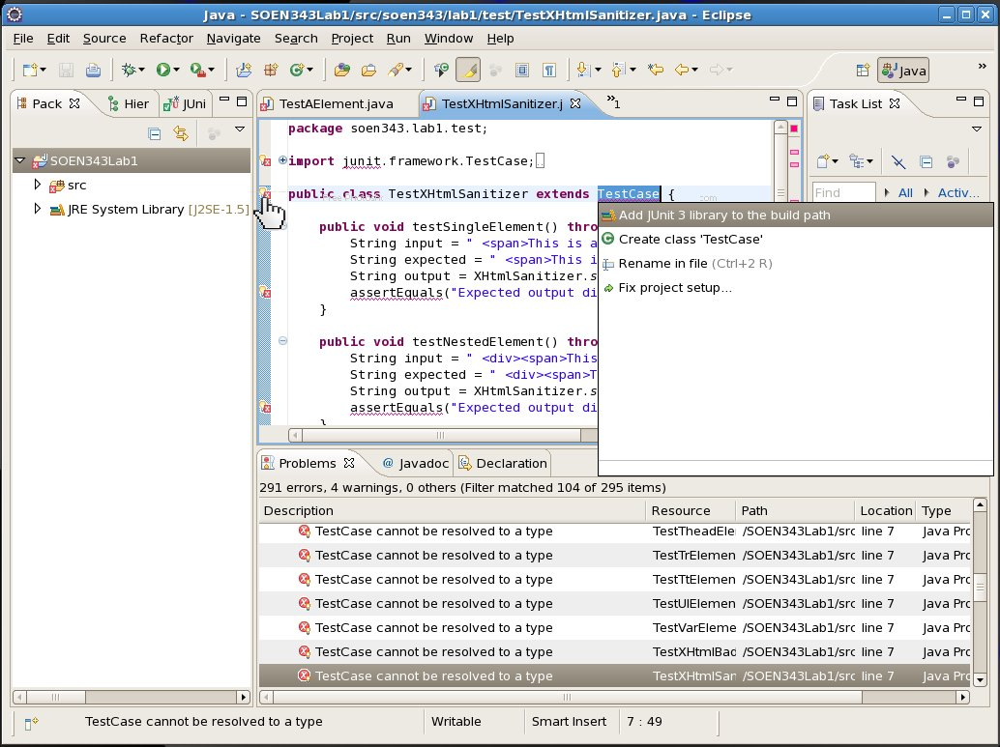

TestCase cannot be resolved to a type
=====================================

This means that your project isn’t setup to include the JUnit libraries when it compiles; JUnit is not included in the Java runtime libraries (JRE System Library) so you have to add it to the build path.

The Long Way
------------

To add the JUnit libraries to the Build Path, right-click on your project in the Package Explorer and select "Properties":

You are then taken to a Project Properties Configuration window. Select "Java Build Path" (from the left) and you should see four tabs; "Source", "Projects", "Libraries" and "Order and Export". Select the "Libraries" tab.

Click on "Add External JARs" and add the `junit.jar` libray found at:

    /nfs/encs/ArchDep/i686.linux26-RHEL5/pkg/eclipse-jee.galileo/root/eclipse/plugins/org.junit_3.8.2.v20090203-1005/junit.jar

Click OK and return to the workbench.

### Why "Add External JARs" and Not "Add JARs"?

Since the jar file you’re adding to the build path is _not_ already in the directory structure of your workbench, it is considered an external JAR.

The Short Way
-------------

Open (or write from scratch) a `.java` file which contains a class extending `junit.framework.TestCase`. On the line which declares the class (`public class MyClass extends TestCase`) you’ll see an [Eclipse Quick Fix](http://wiki.eclipse.org/FAQ_What_is_a_Quick_Fix%3F) light bulb:

Click on it and select `Add JUnit 3 library to the build path` and Eclipse will do all of the above much more painlessly for you.
