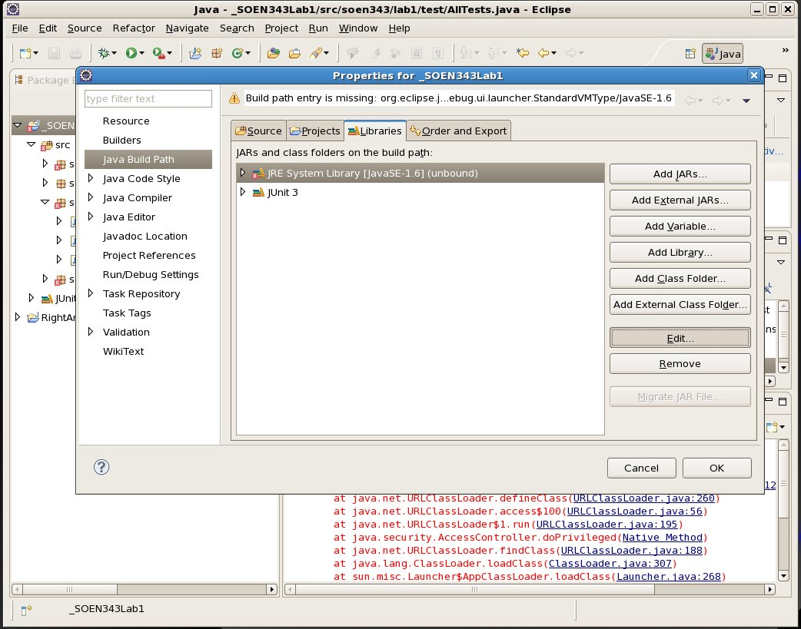
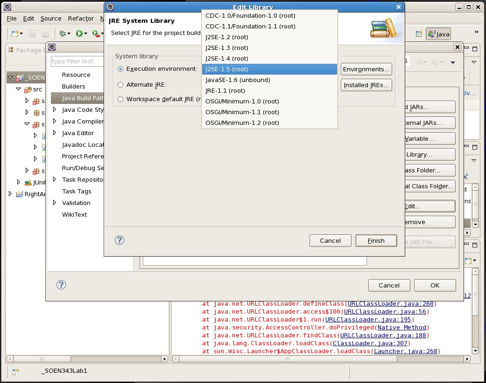

Unbound classpath container and Bad version number in .class file
=================================================================

Sometimes, when you download an Eclipse project, it will give you some trouble; you’ll get build errors like this one:

    Unbound classpath container: 'JRE System Library [JavaSE-1.6]' in project

Or runtime errors like this one:

    java.lang.UnsupportedClassVersionError: Bad version number in .class file

This means that for some reason there’s an inconsistency between the JRE version of the compiler the project was developed on and your own; to fix the issue, clean the project:

Once you’ve cleaned the project you’ll need to change the JRE execution environment. To do this, from the Project Properties window, select the Java Build Path, and from the Libraries tag choose to edit the JRE System library.

Change the JRE execution environment to `J2SE-1.5`:

With luck, this will fix the problem.
