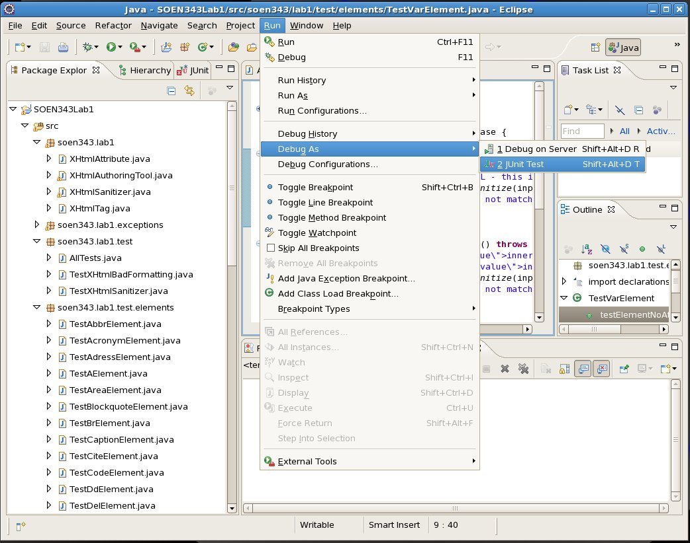
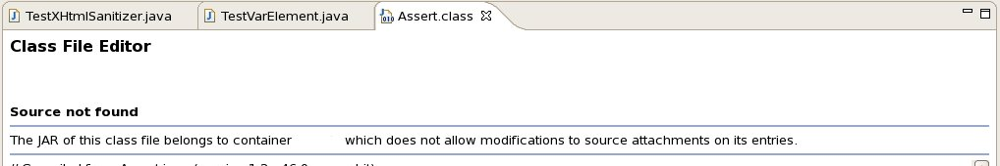
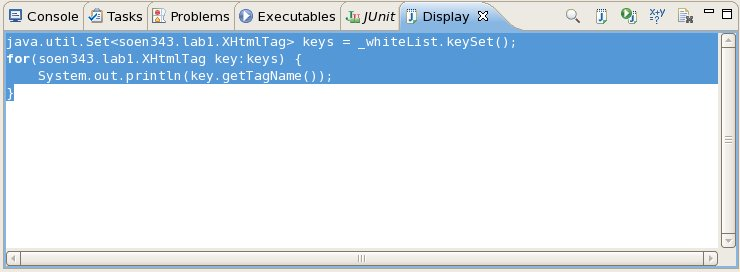
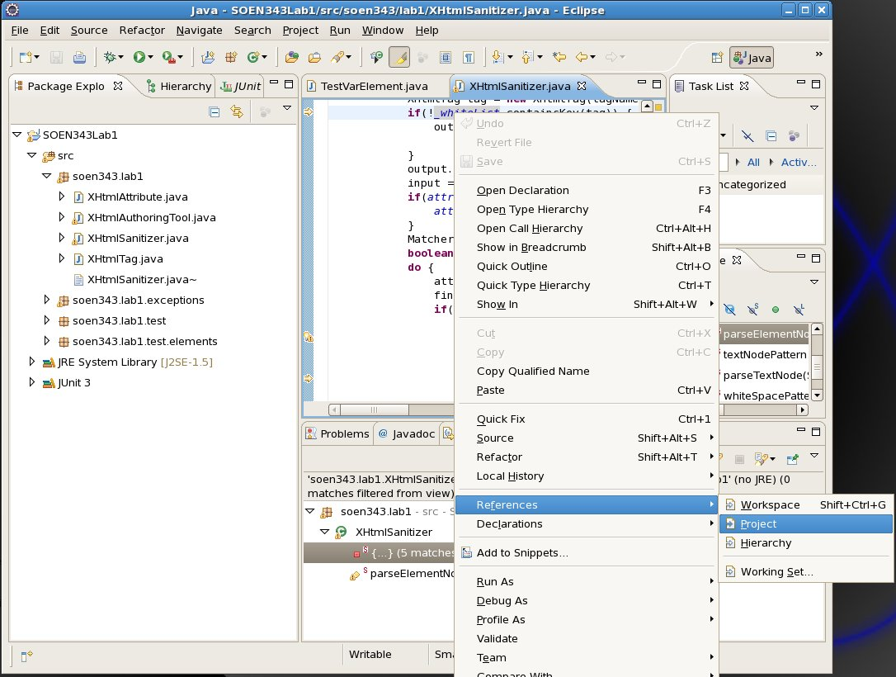

Debugging With Eclipse
======================

In this tutorial we will review debugging in Eclipse. We’re going to continue from where we left off from the [tutorial on Updating The XHtml Sanitizer](tut-30.updating-the-xhtml-sanitizer.md).

The assumption is that you have performed basic maintenance on the XHtml Sanitizer and now the prior tests are not passing.

Since the maintenance you performed on the XHtml Sanitizer seems to have broken the Unit Tests left by the previous developer, you’re going to have to use the Eclipse debugger to get to the heart of the issue.

Using the Eclipse Debugger
--------------------------

In Eclipse, find one of your failing Test Cases; in my case, all tests in the `TestVarElement` Test Case are failing, so I’m going to use it for my debugging.

Eclipse will let you debug the selected Test Case by selecting `Run > Debug As > JUnit Test`:

When prompted to switch to debug view, say yes.

While debugging you can control execution using the debug commands available in Debug View:

*   **Pause** – You can temporarily suspend execution with the Pause command. When you suspend execution, Eclipse will bring you to the line of code it is currently executing.
    
*   **Resume** – If execution has been suspended and you want execution to continue normally, use the Resume command.
    
*   **Step Over** – When execution is suspended, use the Step Over command to continue execution one line at a time, remaining in the same stack frame (method).
    
*   **Step Into** – When execution is suspended, use the Step Into command to continue execution one line at a time, following execution into other stack frames when methods are called.
    
*   **Step Return** (aka Step Out) – If you have used the Step Into command, use Step Return to go back ‘up’ the stack trace.
    

Before debugging, it’s useful to set some breakpoints in your code by double-clicking in the marker bar – the gray margin to the left of the source code:

When debugging code, execution will automatically pause when your breakpoints are reached:

Place a breakpoint has been placed at the beginning of the `TestVarElement.testElementNoAttributes()` test…

    	public void testElementNoAttributes() throws XHtmlBadFormatException {
    		String input = " <var>innerHTML – this is a test</var> "; // PLACE BREAKPOINT ON THIS LINE
    		String expected = " <var>innerHTML – this is a test</var> ";
    		String output = XHtmlSanitizer.sanitize(input);
    		assertEquals("Expected output did not match actual output.", expected,
    				output);
    	}

… and Debug as a JUnit Test. Use the Step Over debug command until you reach the `String output = XHtmlSanitizer.sanitize(input);` and then Step Into to debug the `XHtmlSanitizer` class.

If you encounter The `Class File Editor` with an error message looking like this:

… it just means you tried to Step Into a method for which you don’t have the source code (such as something from the JRE Library or JUnit).

Get familiar with the Debug Controls until you reach line 213 of `XHtmlSanitizer.java`:

    	if(!_whiteList.containsKey(tag)) {	// check if the tag is white-listed
    		output = new StringBuilder();	// If it is not, then we will use a different StringBuilder
    						//to buffer it and its inner HTML.
    						// this StringBuilder will be discarded afterward.
    	}

If you step over, you’ll notice that even though the XHtml Sanitizer has always been accepted `<var>` before, for some reason it is no longer in the white list.

Stop debugging, and place a breakpoint on line 213 of `XHtmlSanitizer.java`; we’re going to debug again, but this time we’re going to use the Eclipse Display View.

### The Eclipse Display View

If you look up the Eclipse Display View on [help.eclipse.org](http://help.eclipse.org/helios/index.jsp?topic=/org.eclipse.jdt.doc.user/reference/views/display/ref-display_view.htm) you’d find out that:

> The Display View displays the result of evaluating an expression in the context of the current stack frame. You can evaluate and display a selection either from the editor or directly from the Display View.

To open the Eclipse Display View, select `Window > Show View > Display` from the menu bar.

So you can – while debugging – write Java Code, and execute it on the fly while debugging.

Debug the `TestVarElement` Test Case again, and this time when you reach line 213 of `XHtmlSanitizer.java` try this in the Display View:

    java.util.Set<soen343.lab1.XHtmlTag> keys = _whiteList.keySet();
    for(soen343.lab1.XHtmlTag key:keys) {
    	System.out.println(key.getTagName());
    }

Then highlight it all with the mouse:

And then click on the "Display Results of Evaluating Selected Text" button (from the Display View) to see the output in the console.

You’ll be able to see what items _are_ in the white list and which items are _not_.

Searching for References in Eclipse
-----------------------------------

You still don’t know quite _why_ the white list doesn’t contain the elements it did before, but an attentive student might notice that the variable you manipulated was called `whiteList` _not_ `_whiteList` To find out more about this variable `_whiteList` right click it, and select `References > Project` to see all references to that variable in the current project.

You’ll see that the `_whiteList` variable is used 3 times in `parseElementNode(…)` and 5 times in… well, in _something which doesn’t have a name_.

As a rule, things without names are bad; they make it more difficult to communicate and collaborate about them, so right away you should be able to flag this as a [code smell](http://en.wikipedia.org/wiki/Code_smell).

This nameless thing is called a [static code block](http://download.oracle.com/javase/tutorial/java/javaOO/initial.html) and it’s a little known feature of Java. It’s also a **bad** feature.

Place a breakpoint at the beginning of the static code block, and use the debug commands and the Display View to determine what the purpose of the static code block is, as well as if there is a bug in it which is causing the problems.
