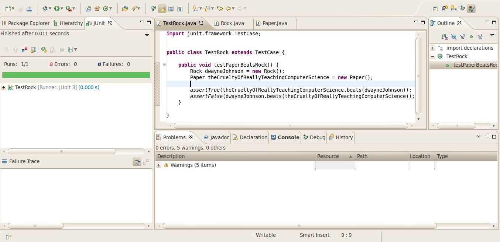
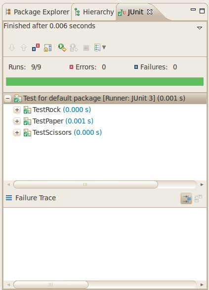

Developing a Rock Paper Scissors Game With TDD: Getting Started
===============================================================

So far in tutorial we’ve been working on Unit Testing and Debugging, but alas this course is about design; we have to move on to more Deisng-oriented activities.

As such for next couple of tutorials, we’re going to practice Test Driven Development in implementing a [Rock Paper Scissors game](http://en.wikipedia.org/wiki/Rock-paper-scissors).

The concept of developing a Rock Paper Scissors game may be revisited again, using a non-TDD approach.

Take note that the steps of the [TDD development cycle](http://en.wikipedia.org/wiki/Test-driven_development#Test-driven_development_cycle) are:

1.  Add a test
2.  Run all tests and see if the new one fails
3.  Write some code to make the test pass
4.  Run all tests again – make sure they all pass
5.  Refactor code

"Refactor code" steps are omitted from this "Getting Started" tutorial, but will be present in the next one, when we see some refactorings.

TDD Step 1.1 – Write a Test
---------------------------

In this case we’re going to start with the "Rock, Paper" part of the game. We know that Rock Beats Paper, so create a new Test Case, and add a single Test Method:

    public class TestRock extends TestCase {
    	
    	public void testPaperBeatsRock() {
    		Rock dwayneJohnson = new Rock();
    		Paper theCrueltyOfReallyTeachingComputerScience = new Paper();
    		
    		assertTrue(theCrueltyOfReallyTeachingComputerScience.beats(dwayneJohnson)>0);
    		assertFalse(dwayneJohnson.beats(theCrueltyOfReallyTeachingComputerScience)>0);
    	}
    	
    }

Note that – since in Rock Paper Scissors the outcomes are ‘win’, ‘lose’ and ‘tie’ – a simple boolean isn’t sufficient; we need to use something more akin to the [Comparable Interface](http://download.oracle.com/javase/6/docs/api/java/lang/Comparable.html) rather than a simple true-false outcome.

TDD Step 1.2 – Run all tests and see if the new one fails
---------------------------------------------------------

We only have one test – the new one – and it won’t even compile, let alone pass. This counts as a failed test; since a test is failing, we can proceed to write code.

TDD Step 1.3 – Write some code to make the test pass
----------------------------------------------------

Our test is failing because it won’t compile, because there are no classes `Rock` or `Paper`. So write up two classes `Rock`:

    public class Rock {
    	// ...
    }

… and `Paper`:

    public class Paper {
    	// ...
    }

We _still_ have 2 build errors though:

`Rock` needs a method `beats(Paper)` – which returns `-1` – and `Paper` needs a method `beats(Rock)` – which returns `1`:

    public class Rock {
    	
    	public int beats(Paper paper) { return -1; }
    	
    }

    public class Paper {
    	
    	public int beats(Rock rock) { return 1; }
    	
    }

TDD Step 1.4 – Run all tests again
----------------------------------

Run your Test Case and you should get a green bar!

TDD Step 2.1 – Write a Test
---------------------------

We now need to test the relationship between `Rock` and `Scissors`, so add a new test method to your `TestRock` Test Case:

    	public void testRockBeatsScissors() {
    		Rock dwayneJohnson = new Rock();
    		Scissors scissors = new Scissors();
    		
    		assertTrue(dwayneJohnson.beats(scissors)>0);
    		assertFalse(scissors.beats(dwayneJohnson)>0);
    	}

TDD Step 2.2 – Run all tests and see if the new one fails
---------------------------------------------------------

Again, the Test Case won’t even compile, let alone pass. This counts as a failed test; since a test is failing, we can proceed to write code.

TDD Step 2.3 – Write some code to make the test pass
----------------------------------------------------

Again, our test is failing because it won’t compile, as there is no class `Scissors`. So write up `Scissors`, and include method `beats(Rock)`:

    public class Scissors {
    	
    	public int beats(Rock rock) { return -1; }
    	
    }

… and add `beats(Scissors)` to `Rock`:

    public class Rock {
    	
    	public int beats(Paper paper) { return -1; }
    	public int beats(Scissors scissors) { return 1; }
    	
    }

TDD Step 2.4 – Run all tests again
----------------------------------

Run your Test Case _again_ and you should get a green bar again!

TDD Step 3.1 – Write a Test
---------------------------

We now need to test the relationship between `Rock` and `Rock`, so add a new test method to your `TestRock` Test Case:

    	 public void testRockTiesRock() {
    		Rock dwayneJohnson = new Rock();
    		Rock alcatraz = new Rock();
    		
    		assertTrue(dwayneJohnson.beats(alcatraz)==0);
    		assertTrue(alcatraz.beats(dwayneJohnson)==0);
    	}

TDD Step 3.2 – Run all tests and see if the new one fails
---------------------------------------------------------

One more time; the Test Case won’t even compile, let alone pass. Class `Rock` doesn’t have a `beats(Rock)` method – which must return 0.

TDD Step 3.3 – Write some code to make the test pass
----------------------------------------------------

… so we have to add a `beats(Rock)` method to class `Rock` – which must return 0.

    public class Rock {
    	
    	public int beats(Paper paper) { return -1; }
    	public int beats(Scissors scissors) { return 1; }
    	public int beats(Rock rock) { return 0; }
    	
    }

TDD Step 3.4 – Run all tests again
----------------------------------

Again, we have the green bar, so we’re _sure_ everything we’ve written up to now is good.

TDD Step 4.X – Repeat the above for Paper and Scissors
------------------------------------------------------

So we’ve created a TestCase for Rock; now we need the same for Paper and Scissors. In the end you should have the following source files:

### Rock.java

    public class Rock {
    	
    	public int beats(Paper paper) { return -1; }
    	public int beats(Scissors scissors) { return 1; }
    	public int beats(Rock rock) { return 0; }
    	
    }

### Paper.java

    public class Paper {
    	
    	public int beats(Scissors scissors) { return -1; }
    	public int beats(Rock rock) { return 1; }
    	public int beats(Paper paper) { return 0; }
    	
    }

### Scissors.java

    public class Scissors {
    	
    	public int beats(Rock rock) { return -1; }
    	public int beats(Paper paper) { return 1; }
    	public int beats(Scissors scissors) { return 0; }
    	
    }

### TestRock.java

    public class TestRock extends TestCase {
    	
    	public void testPaperBeatsRock() {
    		Rock dwayneJohnson = new Rock();
    		Paper theCrueltyOfReallyTeachingComputerScience = new Paper();
    		
    		assertTrue(theCrueltyOfReallyTeachingComputerScience.beats(dwayneJohnson)>0);
    		assertFalse(dwayneJohnson.beats(theCrueltyOfReallyTeachingComputerScience)>0);
    	}
    	
     	public void testRockBeatsScissors() {
    		Rock dwayneJohnson = new Rock();
    		Scissors scissors = new Scissors();
    		
    		assertTrue(dwayneJohnson.beats(scissors)>0);
    		assertFalse(scissors.beats(dwayneJohnson)>0);
    	}
     	
     	public void testRockTiesRock() {
    		Rock dwayneJohnson = new Rock();
    		Rock alcatraz = new Rock();
    		
    		assertTrue(dwayneJohnson.beats(alcatraz)==0);
    		assertTrue(alcatraz.beats(dwayneJohnson)==0);
    	}
    	
    }

### TestPaper.java

    public class TestPaper extends TestCase {
    	
    	public void testPaperBeatsRock() {
    		Rock dwayneJohnson = new Rock();
    		Paper theCrueltyOfReallyTeachingComputerScience = new Paper();
    		
    		assertTrue(theCrueltyOfReallyTeachingComputerScience.beats(dwayneJohnson)>0);
    		assertFalse(dwayneJohnson.beats(theCrueltyOfReallyTeachingComputerScience)>0);
    	}
    	
     	public void testScissorsBeatsPaper() {
     		Paper theCrueltyOfReallyTeachingComputerScience = new Paper();
    		Scissors scissors = new Scissors();
    		
    		assertTrue(scissors.beats(theCrueltyOfReallyTeachingComputerScience)>0);
    		assertFalse(theCrueltyOfReallyTeachingComputerScience.beats(scissors)>0);
    	}
     	
     	public void testPaperTiesPaper() {
     		Paper theCrueltyOfReallyTeachingComputerScience = new Paper();
     		Paper aCaseAgainstTheGoToStatement = new Paper();
    		
    		assertTrue(theCrueltyOfReallyTeachingComputerScience.beats(aCaseAgainstTheGoToStatement)==0);
    		assertTrue(aCaseAgainstTheGoToStatement.beats(theCrueltyOfReallyTeachingComputerScience)==0);
    	}
    	
    }

### TestScissors.java

    public class TestScissors extends TestCase {
    	
    	public void testRockBeatsScissors() {
    		Rock dwayneJohnson = new Rock();
    		Scissors scissors = new Scissors();
    		
    		assertTrue(dwayneJohnson.beats(scissors)>0);
    		assertFalse(scissors.beats(dwayneJohnson)>0);
    	}
    	
     	public void testScissorsBeatsPaper() {
     		Paper theCrueltyOfReallyTeachingComputerScience = new Paper();
    		Scissors scissors = new Scissors();
    		
    		assertTrue(scissors.beats(theCrueltyOfReallyTeachingComputerScience)>0);
    		assertFalse(theCrueltyOfReallyTeachingComputerScience.beats(scissors)>0);
    	}
     	
     	public void testScissorsTiesScissors() {
     		Scissors scissors1 = new Scissors();
     		Scissors scissors2 = new Scissors();
    		
    		assertTrue(scissors1.beats(scissors2)==0);
    		assertTrue(scissors2.beats(scissors1)==0);
    	}
    	
    }

### AllTests.java

For good measure you should also have a TestSuite:

    public class AllTests {
    	
    	public static Test suite() {
    		TestSuite suite = new TestSuite("Test for default package");
    		suite.addTestSuite(TestRock.class);
    		suite.addTestSuite(TestPaper.class);
    		suite.addTestSuite(TestScissors.class);
    		return suite;
    	}
    	
    }

All tests should be passing:

Next Tutorial: Refactoring
--------------------------

Now we’re going to do some refactoring in the next tutorial, before continuing with development.
