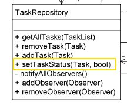

Some Retrospective on Assignment 1
==================================

When To Use The Singleton

Several students used Singleton in their submissions, but you have to be careful with Singleton.

The Singleton pattern is a heavily criticized pattern. For example, in 2004, at an [OOPSLA conferece](http://www.splashcon.org/), some participants debated which patterns should be discarded, and [Singleton was one so considered](http://martinfowler.com/bliki/OOPSLA2004.html). Singletons are also a pain [if you take your testing seriously](http://www.ibm.com/developerworks/webservices/library/co-single.html).

As such when you use a Singleton, _you have to be prepared to justify your choice_ or the hotshots like Martin Fowler will laugh you off stage.

So where can we use a Singleton in the Task Manager?

Personally, I see only one (semi-)justifiable use of Singleton in this solution: the member \`TaskManager::repository\` could be argued as incohesive with the purpose of a GRASP Controller. We could remove this member by making \`TaskRepository\` a Singleton.

Some might argue that you could make the \`TaskManager\` a Singleton, that you would never need more than one instance of \`TaskManager\`. While this is true, but this justification is lacking in the vocabulary of this course; it makes no mention of design principles, and as such it is a weak argument.

Note that just because you have a (semi-)justifiable reason to make the repository a Singleton doesn’t mean you should at this point; for assignment 2 you have a special component which a Singleton may prevent you from producing…

Set Task Status
---------------

A noticable discrepancy between Professor Sinnig’s solution and the on I showcased in tutorials is the placement of the ‘set Task status’ behavior.

### Professor Sinnig’s Solution

In Professor Sinnig’s solution, `setTaskStatus(…)` is a method of the repository:

… and the Controller just delegates to the repository:

    	public void setTaskToComplete(Task aTask) {
    		repository.setTaskStatus(aTask, true);
    	}
    	
    	public void setTaskToIncomplete(Task aTask) {
    		repository.setTaskStatus(aTask, false);
    	}

He’s done this because a Controller handles system events, and shouldn’t handle too much of the business logic; instead it should delegate. Putting too much business logic in a Controller is a violation the High Cohesion. (see "Bloated Controllers" on page 311 of "Applying UML and Patterns" by Larman)

### The Tutorial Solution

In the Tutorials, the behavior of the `setTaskStatus(…)` was usually be in the Controller:

    	public void setTaskToComplete(Task aTask) {
    		aTask.setStatus(true);
    	}
    	
    	public void setTaskToIncomplete(Task aTask) {
    		aTask.setStatus(false);
    	}

… and the repository had no such method, as that would be incohesive with the purpose of a repository.

### Consolidating the Solutions

So which solution is right? The polite answer is they are both right; the strict answer is neither is right since they’re both in violation of High Cohesion.

So what is the alternative? What do we do when we have behaviors (responsibilities) which don’t belong anywhere else?

### Pattern: Pure Fabrication

We can apply Pure Fabrication, and add new objects which represent the business logic in question. To do this, we can use the [Command Pattern](http://en.wikipedia.org/wiki/Command_pattern).
