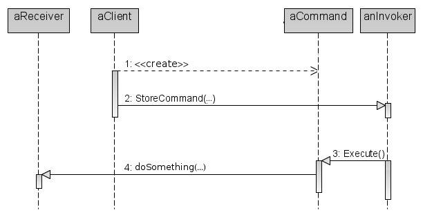

The Command Pattern
===================

In this tutorial we’re going to go over implementing the Command Pattern.

Why the Command Pattern?
------------------------

So there are two big reasons you want to use the Command Pattern in assignment 2:

### High Cohesion and Set Task Status

In assignment 1, there was debate over which object should be responsible for "Set Task Status" – no matter where that functionality was put it seemed to violate High Cohesion. As such we should apply Pure Fabrication and create an object responsible for these kinds of behaviors of the system: a Command.

### New Feature: Undo-Redo

Additionally, the Command Pattern is meant to support undo – this is even listed as one of its applications in the GoF book – and you are required to provide undo operations for certain functions of the Task Manager, iteration 2.

The Participants
----------------

So the command pattern is composed of 5 participants:

*   The Command
*   The Concrete Command(s)
*   The Client
*   The Invoker
*   The Receiver

These participants should interact according to the following sequence diagram:

Before we implement the Command Pattern, we need to decide on which components fulfill these roles.

Let’s look at Dr Sinnnig’s solution, and identify which components should be used as which participants.

### The Command and The Concrete Command

From earlier observations which led us to Command, it’s a given that we need to add a component – either an abstract class or an interface – `Command` and at least one Concrete Command, `SetTaskStatus`:

We know that the responsibilities of class `SetTaskStatus` belong in the domain layer; it is a representation of business logic, and all along – whether you had put this behavior in the Repository or the Controller – that behavior has belonged in the domain layer.

So we’ve identified two of our participants as being new classes we’re developing, but what about the rest? What about the Client, the Invoker and the Receiver?

### The Receiver

In the case of `SetTaskStatus` the Receiver is the component being manipulated; the real end to this system operation is:

    Task mytask = /* ... */;
    mytask.setStatus(wtv);

So the Receiver is `Task`.

### The Client

The Client creates an instance of a Concrete Command, and specifies its receiver, so we can imagine some code which looks a little like this:

    Task myTask = /* ... */;
    SetTaskStatus command = new SetTaskStatus();
    command.setTask(myTask); // specify the receiver
    command.setNewStatus(true);

To figure out which component is the Client, we can apply the Creator Pattern: who has the initializing data for this command? If we look back at the Controller from the sample solution, it has a method `setTaskToComplete(Task aTask)` which accepts an instance of `Task` as a parameter: the GUI provided some input.

Therefore the GUI had knowledge of what is now our Receiver; therefore the Client is a GUI component.

### The Invoker

Lastly, which class should be the Invoker? Which component should actually be responsible for calling `ConcreteCommand::execute()`?

One of the reasons Professor Sinnig chose to put the `setTaskStatus(…)` method in the Repository was because a Controller should not contain business logic, and instead should delegate to other objects in the domain layer. Since the Controller is meant to delegate to the command objects, the Controller plays the role of the Invoker.

Example Code
------------

Here is an example of how you can put together these participants for assignment 2:

### The Command

    package soen343.commandpatternexample.domain;
    	
    public abstract class Command {
    	// this method is protected
    	// so it can't be called directly from the GUI
    	protected abstract void execute();
    }

### The Concrete Command

    package soen343.commandpatternexample.domain;
    	
    public class SetTaskStatus extends Command {
    	
    	private Task task;
    	private boolean newStatus;
    	
    	public SetTaskStatus(Task task, boolean newStatus) {
    		this.task = task;
    		this.newStatus = newStatus;
    	}
    	
    	protected void execute() {
    		task.setStatus(newStatus);
    	}
    }

### The Client

    package soen343.commandpatternexample.presentation;
    	
    public class SetTaskStatusButton extends JButton {
    	
    	public SetTaskStatusButton(Task task, boolean newStatus) {
    		super("Set task " + task.getId() + " to "  + (newStatus?"done":"not done"));
    		Command command = new SetTaskStatus(task, newStatus);
    		final Controller controller = new Controller();
    		controller.setCommand(command);
    		this.addActionListener(new ActionListener() {
    				public void actionPerformed(ActionEvent e) {
    					controller.executeCommand();
    				}
    			}
    		);
    	}
    }

### The Invoker

    package soen343.commandpatternexample.domain;
    	
    public class Controller {
    	private Command command;
    	
    	public void setCommand(Command command) {
    		this.command = command;
    	}
    	
    	public void executeCommand() {
    		System.out.println("Begin System Event: Executing " + command.getClass().getName());
    		command.execute();
    		System.out.println("End System Event (" + command.getClass().getName() + ")");
    	}
    }

### The Receiver

    package soen343.commandpatternexample.domain;
    	
    public class Task {
    	private boolean status;
    	private int id;
    	
    	// again, protected as we don't want these members
    	// being called from the presentation layer
    	protected void setStatus(boolean status) {
    		this.status = status;
    	}
    	public boolean getStatus() {
    		return status;
    	}
    	public int getId() {
    		return id;
    	}
    }

### A Test Case

    public class TestSetTaskStatusButton extends TestCase {
    	
    	public void testClick() {
    		
    		Task t = new Task();
    		boolean expected = true;
    		SetTaskStatusButton button = new SetTaskStatusButton(t, expected);
    		button.doClick();
    		assertEquals(expected, t.getStatus());
    		
    		expected = false;
    		button = new SetTaskStatusButton(t, expected);
    		button.doClick();
    		assertEquals(expected, t.getStatus());
    		
    	}
    	
    }

The Sequence Diagram
--------------------

Here is the sequence diagram we saw above, now with our implementation classes and the proper method names in place of the names of the pattern participants:

What about Undo?
----------------

That is explicitly described in the GoF book, but I’ll offer a hint: which object knows how to "do" something? Respecting Information Expert, doesn’t it make sense that the same object would also "undo" as well?
