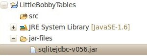
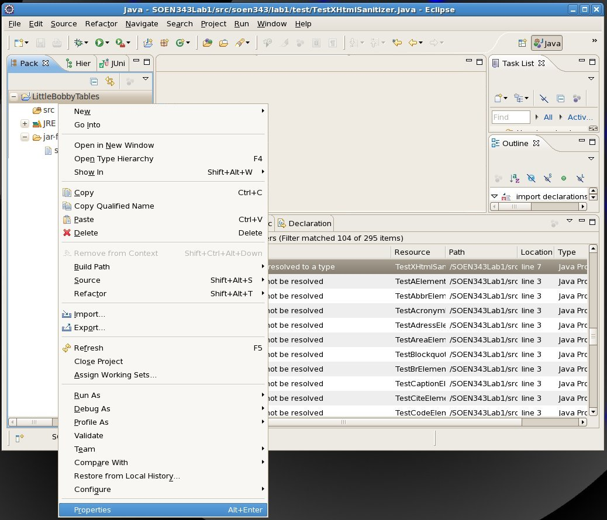
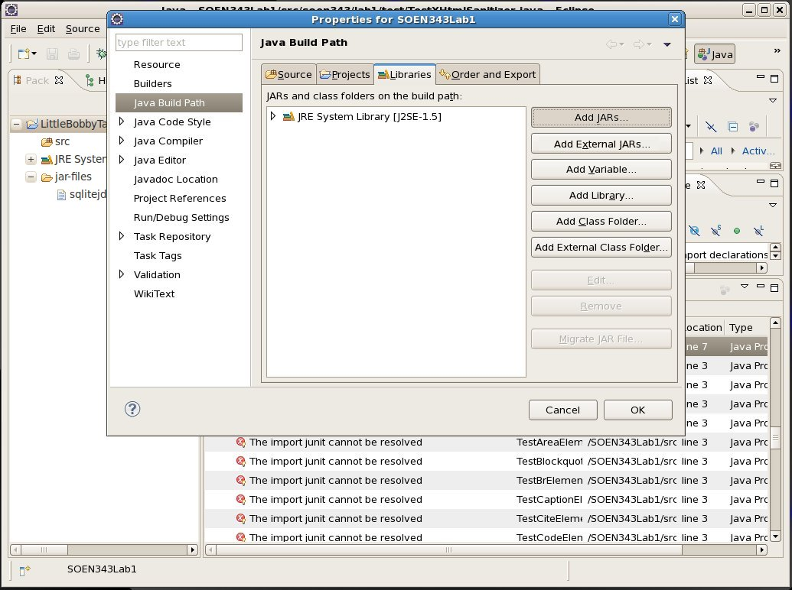
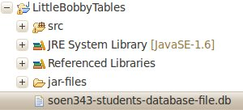

Java And Databases 101
======================

We’ve reached the Technical Services layer in the typical 3-layer design, but before you start adding TS-layer patterns to your assignments, you need to have a little bit of database background. Connecting to a database in Java isn’t as easy as it is in PHP, so for those of your who haven’t done this before we’re providing this tutorial.

So create a new Eclipse project and name it something relevant like "MyFirstDatabaseApp" or [LittleBobbyTables](http://xkcd.com/327/). (I’ve named mine "LittleBobbyTables")

Unfortunately we don’t have access to a proper database server, so you’re going to have to make due with an [SQLite](http://en.wikipedia.org/wiki/SQLite) database.

The Java JDBC driver for SQLite
-------------------------------

Before we begin, you’ll need to download the Java JDBC driver for SQLite – `sqlitejdbc-v056.jar` – from [David Crawshaw’s website](http://www.zentus.com/sqlitejdbc/). ~~If you are unable to do so for some reason, I also have a copy on my website.~~

Toss the jar file somewhere in your project:

You now need to add the Java JDBC driver for SQLite (sqlitejdbc-v056.jar) to the Build Path: right-click on your project in the Package Explorer and select "Properties".

You are then taken to a Project Properties Configuration window. Select "Java Build Path" (from the left) and you should see four tabs; "Source", "Projects", "Libraries" and "Order and Export". Select the "Libraries" tab.

Click on "Add JARs" and add the `sqlitejdbc-v056.jar` library from your project.

`SELECT` Statements
-------------------

So now we have the driver we need, we’ll start with the most basic SQL statement we can think of: a `SELECT` statement.

For the following code to work, you’ll need a `.db` file, which includes table `students`, so either create one or [download the one I have created](assets/tut-70.soen343-students-database-file.db). Put it in the root folder of your project:

    import java.sql.DriverManager;
    import java.sql.Connection;
    import java.sql.PreparedStatement;
    import java.sql.ResultSet;
    	
    // ...
    	
    try {
    	Class.forName("org.sqlite.JDBC"); // make sure that Java has loaded the SQLite driver
    	
    	Connection db = DriverManager.getConnection("jdbc:sqlite:soen343-students-database-file.db");
    										// SQLite stored your database in a file
    										// in this case the name
    										// of the file we're using is
    										// 'soen343-students-database-file.db'
    	
    	String statement = "SELECT `guid`, `studentID`, `name` FROM `students` where `studentID` = ? AND `name` = ?";
    	PreparedStatement dbStatement = db.prepareStatement(statement);
    	dbStatement.setInt(1, 3141592); // now the first ? placeholder has a value of 
    	dbStatement.setString(2, "Timmy O'Toole"); // now the second ? placeholder has a value of "Timmy O'Toole"
    	// Why the `set` methods? It helps avoid SQL Injection attacks
    	// for more on SQL Inject, which out http://en.wikipedia.org/wiki/SQL_injection
    	
    	ResultSet rs = dbStatement.executeQuery();
    	
    	System.out.println("================================================================================");
    	while(rs.next()) { // iterate over all rows from the query
    		String guid = rs.getString("guid");
    		String name = rs.getString("name");
    		int studentID = rs.getInt("studentID");
    		System.out.println(guid + "\t| " + name + "\t| " + studentID);
    		System.out.println("================================================================================");
    	}
    	
    } catch (Exception e) {
    	System.out.println("Well that didn't go as planned…");
    	e.printStackTrace();
    }

### `PreparedStatement`

You might be wondering "What’s this `PreparedStatement` nonsense?" Using `PreparedStatement` provides two advantages:

*   Using place holders helps prevent SQL injection. (see [Preventing SQL injection on Wikipedia](http://en.wikipedia.org/wiki/SQL_injection#Parameterized_statements))
*   You can re-use a `PreparedStatement`, changing only the value of its placeholders:

    	// You can re-use a PreparedStatement
    	PreparedStatement dbStatement = db.prepareStatement(statement);
    	
     	for(int i=0; i<10; i++) {
    		dbStatement.setInt(1, i);
    		dbStatement.setString(2, new Date().toString());
    		
    		ResultSet rs = dbStatement.executeQuery();
    		/* ... */
    	}

`UPDATE` Statements and `INSERT` Statements
-------------------------------------------

`UPDATE` and `INSERT` Statements work slightly differently; since they manipulate data (change stuff) as opposed to only reading data, you can’t use the `PreparedStatement::executeQuery()` method:

**The following is a fail:**

    try {
    	Class.forName("org.sqlite.JDBC"); // make sure that Java has loaded the SQLite driver
    	
    	Connection db = DriverManager.getConnection("jdbc:sqlite:soen343-students-database-file.db");
    										// SQLite stored your database in a file
    										// in this case the name
    										// of the file we're using is
    										// 'soen343-students-database-file.db'
    	
    	String statement = "INSERT INTO `students` (`guid`, `studentID`, `name`) VALUES (?, ?, ?)";
    	PreparedStatement dbStatement = db.prepareStatement(statement);
    	dbStatement.setString(1, "fdff17a2-e1e0-4630-8b22-f7bb3310d0a7");
    	dbStatement.setInt(2, 1234567); 
    	dbStatement.setString(3, "Joseph Marterson");
    	ResultSet rs = dbStatement.executeQuery(); // throws an exception
    } catch (Exception e) {
    	System.out.println("Well that didn't go as planned…");
    	e.printStackTrace();
    }

You instead have to use the `PreparedStatement::executeUpdate()` method:

    try {
    	Class.forName("org.sqlite.JDBC"); // make sure that Java has loaded the SQLite driver
    	
    	Connection db = DriverManager.getConnection("jdbc:sqlite:soen343-students-database-file.db");
    										// SQLite stored your database in a file
    										// in this case the name
    										// of the file we're using is
    										// 'soen343-students-database-file.db'
    	
    	String statement = "INSERT INTO `students` (`guid`, `studentID`, `name`) VALUES (?, ?, ?)";
    	PreparedStatement dbStatement = db.prepareStatement(statement);
    	dbStatement.setString(1, "fdff17a2-e1e0-4630-8b22-f7bb3310d0a7");
    	dbStatement.setInt(2, 1234567); 
    	dbStatement.setString(3, "Joseph Marterson");
    	int numberOfRowsAffected = dbStatement.executeUpdate();
    } catch (Exception e) {
    	System.out.println("Well that didn't go as planned…");
    	e.printStackTrace();
    }

The same goes for `UPDATE` statements, that is to say that they need to use `executeUpdate()` as opposed to `executeQuery()`:

    try {
    	Class.forName("org.sqlite.JDBC"); // make sure that Java has loaded the SQLite driver
    	
    	Connection db = DriverManager.getConnection("jdbc:sqlite:soen343-students-database-file.db");
    									// SQLite stored your database in a file
    									// in this case the name
    									// of the file we're using is
    									// 'soen343-students-database-file.db'
    	
    	String statement = "UPDATE `students` SET studentID=?";
    	PreparedStatement dbStatement = db.prepareStatement(statement);
    	dbStatement.setInt(1, 1414213); 
    	int numberOfRowsAffected = dbStatement.executeUpdate();
    } catch (Exception e) {
    	System.out.println("Well that didn't go as planned…");
    	e.printStackTrace();
    }
