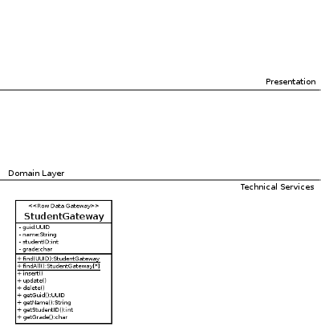

Implementing the Row Data Gateway Pattern
=========================================

The first Data Source Pattern which is present in the the course slides (aside from a Database Connection [Registry](http://martinfowler.com/eaaCatalog/registry.html)) was the [Row Data Gateway](http://martinfowler.com/eaaCatalog/rowDataGateway.html).

A Row Data Gateway represents a single row in a table; that’s it. Its members can be regarded as being either…

*   Data attributes which correspond exactly to columns in the table
*   Behavior (methods) which handle querying the database (SQL)

It’s important to note that in an RDG there are no methods which aren’t either getters/setters or SQL. The moment you introduce other methods (in particular domain logic) the object becomes an Active Record.

So what if we write an RDG for table `student` which contains the following data: ([download](assets/tut-70.soen343-students-database-file.db))

    +--------------------------------------+------------------+-----------+-------+
    | guid                                 | name             | studentID | grade |
    +--------------------------------------+------------------+-----------+-------+
    | 685c1630-9085-4f24-a43b-19cee957483a | Timmy O'Toole    | 3141592   | C     |
    +--------------------------------------+------------------+-----------+-------+
    | 28141656-8e64-47f8-83f8-3f6de9af2531 | Andrey Conall    | 6535897   | C     |
    +--------------------------------------+------------------+-----------+-------+
    | 97684799-c5a0-4a28-b989-c504957fcb98 | Daniel Sarosh    | 9323846   | A     |
    +--------------------------------------+------------------+-----------+-------+
    | b1dd68cb-d9c9-4fc1-81b4-e6a9abfbc401 | Odis Degado      | 2643383   | C     |
    +--------------------------------------+------------------+-----------+-------+
    | 6c0759bb-325d-4259-97d2-1957e78d170a | Veda Goettig     | 2795028   | A     |
    +--------------------------------------+------------------+-----------+-------+
    | dee167bc-e902-49ff-ae57-67a7ad11fac2 | Geraldo Hoffstot | 8419716   | F     |
    +--------------------------------------+------------------+-----------+-------+
    | efd2ebbf-c4ec-4958-b9de-2cb5c9f593fd | Nicolas Arndt    | 9399375   | C     |
    +--------------------------------------+------------------+-----------+-------+
    | 5ad8adcc-1f28-4cdd-a208-54621576b779 | Delmer Dearth    | 1058209   | C     |
    +--------------------------------------+------------------+-----------+-------+
    | eccecb3c-a771-485c-9083-2d4c4e4fa336 | Heidi Bras       | 7494459   | C     |
    +--------------------------------------+------------------+-----------+-------+
    | d5f0cb0f-f32d-4dc4-8135-5e059b91218a | Kennith Khatak   | 2307816   | F     |
    +--------------------------------------+------------------+-----------+-------+

Our RDG would be composed of:

*   Data attributes which correspond exactly to columns in the table
    *   guid
    *   name
    *   studentID
    *   grade
*   Behavior (methods) which handle querying the database (SQL)
    *   insert
    *   update
    *   delete
    *   select find (not an _instance_ member)

… and would look something like this:

  

Writing the RDG
---------------

So we’ve considered the relevant members an RDG should have, and now we’re ready to write some code.

### Attributes

We’ll start with implementing our `PersonGateway` class with the attributes:

    package technicalservices;
    	
    import java.util.UUID;
    	
    public class PersonGateway {
    	
    	private final UUID guid; // Note that unique ID is read-only!
    	private int studentID;
    	private String name;
    	private char grade;
    	
    	public PersonGateway() {
    		this.guid = UUID.randomUUId();
    	}
    	
    	public PersonGateway(UUID guid) {
    		this.guid = guid;
    	}
    	
    }

### Getters and Setters

You can get Eclipse to automatically generate getters and setters for your `PersonGateway` class; right click in the Editor and select `Source > Generate Getters and Setters`:

### Finders

Once you have getters and setters, you’re ready to write your finder methods. We’ll start with a `findByGuid` method:

    	public synchronized static StudentGateway findByGuId(UUID uniqueID) throws StudentGatewayException {
    		try {
    			Connection db =	/* You need an object which is responsible for opening and closing connections */
    					/* see slide #9 of "Topic 07b: Data Source Patterns" */
    			
    			String statement = "SELECT `guid`, `grade`, `studentID`, `name` FROM `students` where `guid`=?";
    			PreparedStatement dbStatement = db.prepareStatement(statement);
    			dbStatement.setString(1, uniqueID.toString());
    			ResultSet rs = dbStatement.executeQuery();
    			
    			while(rs.next()) {
    				UUID guid = UUID.fromString(rs.getString("guid"));
    				String name = rs.getString("name");
    				char grade = rs.getString("grade").charAt(0);
    				int studentID = rs.getInt("studentID");
    				
    				StudentGateway student = new StudentGateway(guid);
    				student.name = name;
    				student.grade = grade;
    				student.studentID = studentID;
    				
    				return student;
    			}
    			return null;
    			
    		} catch (SQLException e) {
    			// We don't want any types which use the StudentGateway
    			// to be coupled to java.sql.SQLException
    			// So instead, we throw a custom StudentGatewayException 
    			throw new StudentGatewayException("Error occured reading Students from the data source.", e);
    		}
    	}

### Insert, Update and Delete

I’m not going to write examples of `insert()` and `delete()`, but I will provide an example of an `update()` method:

    	public synchronized void update() throws StudentGatewayException {
    		try {
    			Connection db =	/* You need an object which is responsible for opening and closing connections */
    					/* see slide #9 of "Topic 07b: Data Source Patterns" */
    	
    			String statement = "UPDATE `students` SET `grade`=?, `studentID`=?, `name`=? where `guid`=?";
    			PreparedStatement dbStatement = db.prepareStatement(statement);
    			dbStatement.setString(1, Character.toString(this.grade));
    			dbStatement.setInt(2, this.studentID);
    			dbStatement.setString(3, this.name);
    			dbStatement.setString(4, this.guid.toString());
    			dbStatement.executeUpdate();
    			
    		} catch (SQLException e) {
    			// We don't want any types which use the StudentGateway
    			// to be coupled to java.sql.SQLException
    			// So instead, we throw a custom StudentGatewayException 
    			throw new StudentGatewayException("Error occured saving Students to the data source.", e);
    		}
    	}

RDG In Your Application
-----------------------

Row Data Gateway is the first pattern you’re seeing which resides in the bottom layer of the 3-layer architecture, the Technical Services. (or Data Source, depending on who you ask)

When using RDGs for persistence/database interaction, traditionally there are two approaches:

*   The RDG as a data holder for the Domain Model Object
*   Discarding Domain Model Objects

### The RDG as a data holder for the Domain Model Object

The first is to give your Domain Model object an instance variable of type Row Data Gateway, and have the Domain Model’s getters/setters delegate to it:

.. but this is a little strange, the Domain Model object is supposed to be derivative of your Domain Model Diagram, which contains attributes. I mean, why would you move members of the _Domain_ (keyword: DOMAIN) Model object out of the _domain_ layer, down to the Technical Services layer?

### Discarding Domain Model Objects

The second option is to discard the Domain Model Objects and manipulate RDG objects directly whenever you would have been working with the Domain Model Object. In a small application you can get away with this, but it doesn’t scale well:

*   First, an RDG doesn’t have _any_ domain logic, so dealing with domain logic which would normally be a function of `Student` (like a `passes()` method) becomes more complicated
*   Second, the RDG couples anything it touches to the database structure

So What’s Next?
---------------

You’ve written your first Data Source pattern, that’s great, but what happens when we need methods which aren’t getters/setters or SQL operations for our student object? What if you need methods to determine if a student is passing, or being placed on probation?

The answers to all this and more in the next tutorial, on [implementing Active Record](tut-72.implementing-active-record.md).
