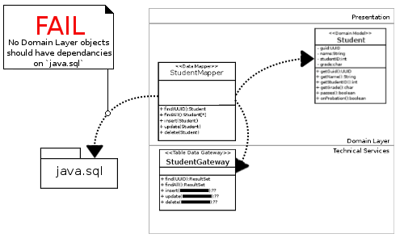
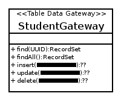

Implementing the Table Data Gateway (and Record Set) Pattern(s)
===============================================================

This tutorial assumes you did the [Row Data Gateway tutorial](tut-71.implementing-row-data-gateway.md), [the Active Record tutorial](tut-72.implementing-active-record.md), and [the Data Mapper tutorial](tut-73.implementing-data-mapper.md).

So we’ve reached the point where we have a Data Mapper in the Technical Services Layer, but leaving it in the Technical Services Layer introduces an upward dependency. (BAD!)

The truth is that the Data Mapper we’ve implemented is effectively stuck between the Domain Layer and the Technical Services Layer because it:

*   Manipulates Domain Model Objects (domain layer)
*   Uses SQL and has a dependency on the `java.sql` package (data source)

Can’t have that, so we need object(s) which will:

1.  Contain any and all SQL statements in the technical services layer ([Table Data Gateway](http://martinfowler.com/eaaCatalog/tableDataGateway.html))
2.  Provide indirection between the Data Mapper and package `java.sql` ([Record Set](http://martinfowler.com/eaaCatalog/recordSet.html))

Writing a TDG
-------------

A TDG – like a RDG – contains methods for SQL operations, but they are scoped to a single table.

I won’t provide an example of a TDG, but I will provide an example of a Data Mapper which uses a TDG:

    public class StudentDataMapper {
    		
    	/* ... */
    	
    	public static synchronized Student findByGuId(UUID uniqueID) throws DataMapperException {
    		try {
    			
    			ResultSet rs = studentGateway.findByGuId(uniqueID);
    			
    			while(rs.next()) {
    				UUID guid = UUID.fromString(rs.getString("guid"));
    				String name = rs.getString("name");
    				char grade = rs.getString("grade").charAt(0);
    				int studentID = rs.getInt("studentID");
    				
    				Student student = new Student(guid);
    				student.setName(name);
    				student.setGrade(grade);
    				student.setStudentId(studentID);
    				
    				return student;
    			}
    			return null;
    			
    		} catch (StudentGatewayException e) {
    			throw new DataMapperException("Error occured reading Students from the data source.", e);
    		} catch (SQLException e) {
    			throw new DataMapperException("Error occured reading Students from the data source.", e);
    		}
    	}
    	
    	public synchronized void update(Student student) throws DataMapperException {
    		try {
    			
    			studentGateway.update(student.getGrade(), student.getStudentId(), student.getName(), student.getGuId());
    			
    		} catch (StudentGatewayException e) {
    			throw new DataMapperException("Error occured saving Students to the data source.", e);
    		}
    	}
    	
    	public synchronized void insert(Student student) throws DataMapperException {
    		try {
    			
    			studentGateway.insert(student.getGrade(), student.getStudentId(), student.getName(), student.getGuId());
    			
    		} catch (StudentGatewayException e) {
    			throw new DataMapperException("Error occured saving Students to the data source.", e);
    		}
    	}
    	
    	public synchronized void delete(Student student) throws DataMapperException {
    		try {
    			
    			studentGateway.delete(student.getGuId());
    			
    		} catch (StudentGatewayException e) {
    			throw new DataMapperException("Error occured saving Students to the data source.", e);
    		}
    	}
    }

The attentive student will note, however that there is **still** a dependency between our Data Mapper class and package `java.sql` in the `findByGuId(…)` method:

    public static synchronized Student findByGuId(UUID uniqueID) throws DataMapperException {
    		try {
    			
    			ResultSet rs = studentGateway.findByGuId(uniqueID);
    			// that's a java.sql.ResultSet
    			
    			/* ... */
    			
    		} catch (StudentGatewayException e) {
    			throw new DataMapperException("Error occured reading Students from the data source.", e);
    		} catch (SQLException e) {
    			throw new DataMapperException("Error occured reading Students from the data source.", e);
    		}
    	}

The end result is _still_ that the Data Mapper has a dependency on `java.sql`:

To fix this, we use a Record Set; an in-memory representation of tabular data which provides indirection and reduces coupling with package `java.sql`.

Writing a Record Set
--------------------

For our current purposes, our Record Set need only be an interface which provides the methods of `java.sql.ResultSet` used by our Data Mapper:

    public interface RecordSet {
    	/* 
    	 * Looks like a java.sql.ResultSet,
    	 * but isn't.
    	 * */
    	
    	public boolean next() throws RecordSetException
    	public java.lang.String getString(java.lang.String arg0) throws RecordSetException
    	public boolean getBoolean(java.lang.String arg0) throws RecordSetException
    	public byte getByte(java.lang.String arg0) throws RecordSetException
    	public short getShort(java.lang.String arg0) throws RecordSetException
    	public int getInt(java.lang.String arg0) throws RecordSetException
    	public long getLong(java.lang.String arg0) throws RecordSetException
    	public float getFloat(java.lang.String arg0) throws RecordSetException
    	public double getDouble(java.lang.String arg0) throws RecordSetException
    	public java.math.BigDecimal getBigDecimal(java.lang.String arg0, int arg1) throws RecordSetException
    	public java.math.BigDecimal getBigDecimal(java.lang.String arg0) throws RecordSetException
    	public boolean first() throws RecordSetException
    	public boolean last() throws RecordSetException
    	public boolean previous() throws RecordSetException;
    	
    }

… and we can change the Table Data Gateway finder methods to return `RecordSet` objects instead of `java.sql.ResultSet` objects:

Now our Data Mapper doesn’t have a dependency on `java.sql.ResultSet`:

    public static synchronized Student findByGuId(UUID uniqueID) throws DataMapperException {
    		try {
    			
    			RecordSet rs = StudentGateway.findByGuId(uniqueID); // No longer a java.sql.ResultSet
    			
    			while(rs.next()) {
    				UUID guid = UUID.fromString(rs.getString("guid"));
    				String name = rs.getString("name");
    				char grade = rs.getString("grade").charAt(0);
    				int studentID = rs.getInt("studentID");
    				
    				Student student = new Student(guid);
    				student.setName(name);
    				student.setGrade(grade);
    				student.setStudentId(studentID);
    				
    				return student;
    			}
    			return null;
    			
    		} catch (StudentGatewayException e) {
    			throw new DataMapperException("Error occured reading Students from the data source.", e);
    		} catch (RecordSetException e) { // previously handled java.sql.SQLException
    			throw new DataMapperException("Error occured reading Students from the data source.", e);
    		}
    	}

… and all is well in our UML diagram:

