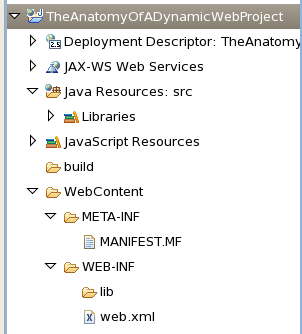
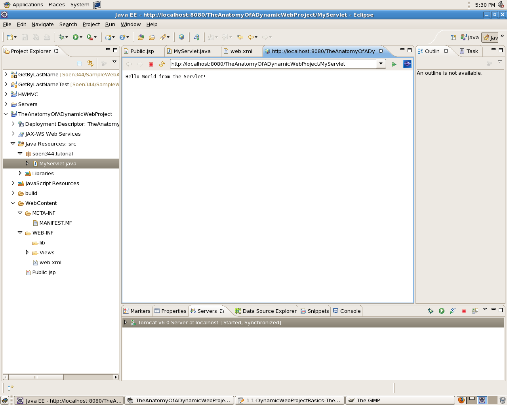
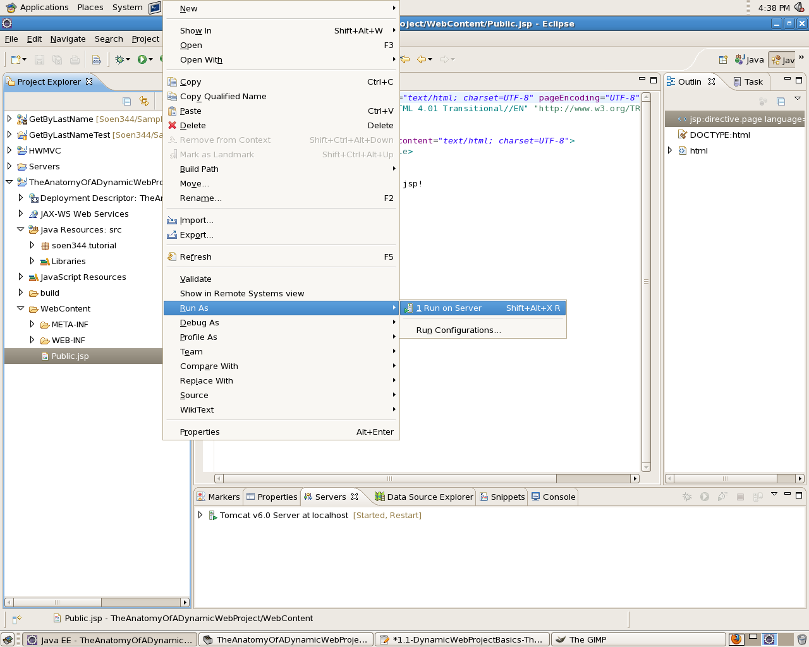
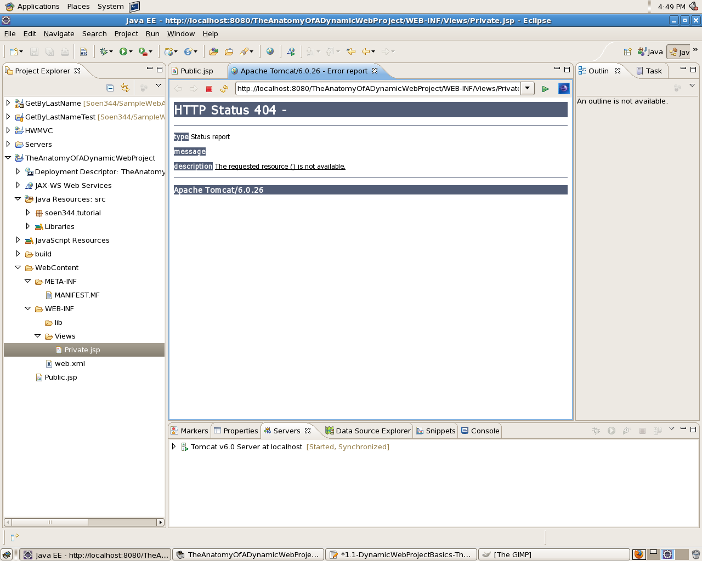

About Servlets and JSPs
=======================

In SOEN344 – Concordia’s Software Architecture course which I’m currently tutoring – the students are going to be working almost exclusively with Dynamic Web Projects in [Eclipse](http://www.eclipse.org/). So I’ve decided to give myself something of a refresher, reviewing the basic anatomy of a Dynamic Web Project, which I have typed up in this news entry.

### Creating a Dynamic Web Project

Assuming you’ve already gone through the sets of setting up the JDK6 and creating an Apache TomCat runtime, one should be able to simply select `File > New > Dynamic Web Project`. If you don’t see "Dynamic Web Project" under `File > New` you can instead select `File > New > Other`:

  

Expand the "Web" folder and select "Dynamic Web Project".

  

Follow the steps in the New Project Wizard, and give the project a name of "TheAnatomyOfADynamicWebProject".

Once you’re done with the New Project Wizard, you should see the following in the Navigation Explorer:

Let’s take a look at some of the folders in your (currently empty) project:

*   `src/` contains the source code for `.java` files in your project, just like for any other Eclipse project you’ve worked with in the past. This folder is only relevant to the Eclipse Project, and isn’t included when you deploy the application on a server.
*   `WebContent/` contains everything which will get deployed to a server. The `WebContent` folder is kind of (only kind of) like the `public_html` or `www` on popular shared-hosting environments like GoDaddy.
*   `WebContent/META-INF/` – Don’t touch this folder. It "[contains the MANIFEST.MF file, which is used to map class paths for dependent JAR files that exist in other projects in the same Enterprise Application project](http://help.eclipse.org/helios/index.jsp?topic=/org.eclipse.wst.webtools.doc.user/topics/ccwebprj.html)", whatever that means.
*   `WebContent/WEB-INF` contains Web Resources which aren’t public (meaning they are not available over the Web)
*   `WebContent/WEB-INF/classes` may not exist in your project, but when you deploy your project, the compiled output is put in this folder.
*   `WebContent/WEB-INF/lib` contains any additional Jar files your project will need.

### A Servlet

Let’s start our Java/TomCat adventure with a Servlet, so let’s create a new Servlet (`File > New > ...`), called "MyServlet", and put it in package `leguen.java.web`. Eclipse should create the following for you:

    package leguen.java.web;
        
    import java.io.IOException;
    import javax.servlet.ServletException;
    import javax.servlet.http.HttpServlet;
    import javax.servlet.http.HttpServletRequest;
    import javax.servlet.http.HttpServletResponse;
       
    /**
     * Servlet implementation class MyServlet
     */
    public class MyServlet extends HttpServlet {
    	private static final long serialVersionUID = 1L;
           
        /**
         * @see HttpServlet#HttpServlet()
         */
        public MyServlet() {
            super();
            // TODO Auto-generated constructor stub
        }
        
    	/**
    	 * @see HttpServlet#doGet(HttpServletRequest request, HttpServletResponse response)
    	 */
    	protected void doGet(HttpServletRequest request, HttpServletResponse response) throws ServletException, IOException {
    		// TODO Auto-generated method stub
    	}
        
    	/**
    	 * @see HttpServlet#doPost(HttpServletRequest request, HttpServletResponse response)
    	 */
    	protected void doPost(HttpServletRequest request, HttpServletResponse response) throws ServletException, IOException {
    		// TODO Auto-generated method stub
    	}
        
    }

#### The Servlet Methods `doGet(…)` and `doPost(…)`

The methods `doGet(…)` and `doPost(…)` correspond to [HTTP methods GET and POST](http://en.wikipedia.org/wiki/Hypertext_Transfer_Protocol#Request_methods) and (though they’re not in the code) Servlets also have `doPut(…)` and `doDelete(…)` (etc) methods too.

    	protected void doPut(HttpServletRequest request, HttpServletResponse response) throws ServletException, IOException {
    		
    	}
    	
    	protected void doDelete(HttpServletRequest request, HttpServletResponse response) throws ServletException, IOException {
    		
    	}

… but don’t bother adding them. Just fill in the `doGet(…)` method as follows:

    	protected void doGet(HttpServletRequest request, HttpServletResponse response) throws ServletException, IOException {
    		response.getOutputStream().print("Hello World from the Servlet!");
    	}

**Build your project**, stop your server, clean your server, publish the server and then right-click the Servlet class so as to select `Run As > Run on Server` and see the output in-browser.

  

Currently, the output of our Servlet is not HTML; we could add HTML to the output, but this starts us down the dark road of violating [Separation of Concerns](http://en.wikipedia.org/wiki/Separation_of_concerns):

**The following technically works, but is considered bad practice**

    package leguen.java.web;
        
    import java.io.IOException;
    import javax.servlet.ServletException;
    import javax.servlet.http.HttpServlet;
    import javax.servlet.http.HttpServletRequest;
    import javax.servlet.http.HttpServletResponse;
        
    /**
     * Servlet implementation class MyServlet
     */
    public class MyServlet extends HttpServlet {
    	private static final long serialVersionUID = 1L;
           
        /**
         * @see HttpServlet#HttpServlet()
         */
        public MyServlet() {
            super();
            // TODO Auto-generated constructor stub
        }
        
    	/**
    	 * @see HttpServlet#doGet(HttpServletRequest request, HttpServletResponse response)
    	 */
    	protected void doGet(HttpServletRequest request, HttpServletResponse response) throws ServletException, IOException {
    		response.getOutputStream().println("<!DOCTYPE html PUBLIC \"-//W3C//DTD HTML 4.01 Transitional//EN\" "+
                                                           "\"http://www.w3.org/TR/html4/loose.dtd\">");
    		response.getOutputStream().println("<html>");
    		response.getOutputStream().println("<head>");
    		response.getOutputStream().println("<meta http-equiv=\"Content-Type\" content=\"text/html; charset=UTF-8\">");
    		response.getOutputStream().println("<title>MyServlet!</title>");
    		response.getOutputStream().println("</head>");
    		response.getOutputStream().println("<body>");
    		response.getOutputStream().println("Hello World from MyServlet!");
    		response.getOutputStream().println("</body>");
    		response.getOutputStream().println("</html>");
    	}
        
    	/**
    	 * @see HttpServlet#doPost(HttpServletRequest request, HttpServletResponse response)
    	 */
    	protected void doPost(HttpServletRequest request, HttpServletResponse response) throws ServletException, IOException {
    		// TODO Auto-generated method stub
    	}
        
    }

Instead, we’ll want to separate the HTML into a [JSP](http://en.wikipedia.org/wiki/JavaServer_Pages) and forward the request to the JSP.

### JSPs in `WebContent/`

Create a JSP file (`File > New > ...`) in folder `WebContent/` and call it `Public.jsp`:

    <%@ page language="java" contentType="text/html; charset=UTF-8" pageEncoding="UTF-8"%>
    <!DOCTYPE html PUBLIC "-//W3C//DTD HTML 4.01 Transitional//EN" "http://www.w3.org/TR/html4/loose.dtd">
    <html>
    <head>
        <meta http-equiv="Content-Type" content="text/html; charset=UTF-8">
        <title>/Public.jsp!</title>
    </head>
    <body>
    	Hello World from /Public.jsp!
    </body>
    </html>

The name `Public.jsp` is arbitrary and has been selected just to help make a point.

Now, in your Servlet, you can leverage the `ServletRequest.getRequestDispatcher(String)` method to forward the request to the JSP:

    	protected void doGet(HttpServletRequest request, HttpServletResponse response) throws ServletException, IOException {
    		request.getRequestDispatcher("/Public.jsp").forward(request, response);
    	}

Again, **build your project**, stop your server, clean your server, publish the server and then right-click the Servlet class so as to select `Run As > Run on Server` and see the output in-browser. Take note of the URL in the browser’s address bar:

    http://localhost:8080/TheAnatomyOfADynamicWebProject/MyServlet

### JSPs in `WEB-INF`

There is a problem, however; since the `WebContent` folder is kind of (**kind of**) like the `public_html` folder of popular hosting environments the browser can request those files directly – without going through the Servlet. This is bad because all input should be going through the Servlet, since the model Id’ like to respect uses the Servlet as a Controller and the JSPs as Views. You shouldn’t be able to access the JSP directly using a URL like this one:

    http://localhost:8080/TheAnatomyOfADynamicWebProject/Public.jsp

… but you can. Try it:right-click on `Public.jsp` and select `Run As > Run on Server`.

  

You will see the output of the JSP in-browser – and if you look at the address bar you’re not at the same URL as you were when you were accessing the Servlet.

  

So, to fix this, create another JSP file, this time in `WebContent/WEB-INF/Views/Private.jsp`.

    <%@ page language="java" contentType="text/html; charset=UTF-8" pageEncoding="UTF-8"%>
    <!DOCTYPE html PUBLIC "-//W3C//DTD HTML 4.01 Transitional//EN" "http://www.w3.org/TR/html4/loose.dtd">
    <html>
    <head>
        <meta http-equiv="Content-Type" content="text/html; charset=UTF-8">
        <title>/WEB-INF/Private.jsp!</title>
    </head>
    <body>
    	Hello World from /WEB-INF/Private.jsp!
    </body>
    </html>

Once you’ve stopped and re-published the server, right-click on the new `Private.jsp` and select `Run As > Run on Server`.

  

This time, you should **not** see the output of your JSP but instead get a 404 page:

  

Now modify your Servlet to forward to `Private.jsp` instead of `Public.jsp`.

    	protected void doGet(HttpServletRequest request, HttpServletResponse response) throws ServletException, IOException {
    		request.getRequestDispatcher("/WEB-INF/Views/Private.jsp").forward(request, response);
    	}

Once you’ve stopped and re-published the server, right-click on the Servlet and select `Run As > Run on Server`. You should see the output of `Private.jsp`:

  

All this to emphasize that the JSPs which should only be accessed via the Servlet (Controller) should go inside the `WEB-INF` folder.
