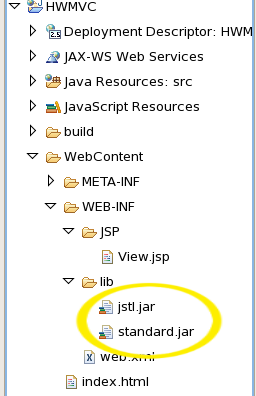

About JSPs
==========

I never really learned to use JSPs to their full potential, and now – in SOEN344, Concordia’s Software Architecture class which I’m currently tutoring – I’m supposed to be teaching students how to use them.

To that end, I’ve written up a little refresher for me to consult.

### JSPs

In its simplest form, JSP is Java trying to do what [PHP](http://en.wikipedia.org/wiki/PHP) and [Classic Asp](http://en.wikipedia.org/wiki/Active_Server_Pages) do: embed code in markup.

    <%@ page contentType="text/html; charset=UTF-8" pageEncoding="UTF-8"%>
    <!DOCTYPE html PUBLIC "-//W3C//DTD XHTML 1.0 Transitional//EN"
             "http://www.w3.org/TR/xhtml1/DTD/xhtml1-transitional.dtd">
    <html xmlns="http://www.w3.org/1999/xhtml" xml:lang="en" lang="en">
        <head>
            <title>Hello World JSP</title>
        </head>
        <body>
            Hello, <%
                /*
                  in the <% tags you can write Java code,
                  similar to <? tags in PHP
                */
                Object o = request.getAttribute("greeting");
                if(o instanceof org.soen387.domain.Greeting) {
                    out.print(((org.soen387.domain.Greeting)o).getName());
                }
            %>
        </body>
    </html>

You could use the above as the `View.jsp` file from SOEN344′s Tutorial 1, and it would work. Feel free to try it… but don’t keep it like that.

Now, if you look at the above and think "This is a great idea!" you’re stuck in the [Stone Age of Web Development](http://en.wikipedia.org/wiki/1990s) and – to be blunt – you need to mature as a developer. Using [scriptlets](http://en.wikipedia.org/wiki/Scriptlet) to embed Java code in markup flirts with being a violation of [separation of concerns](http://en.wikipedia.org/wiki/Separation_of_concerns). It is a messy idea at best, and can easily lead to Domain Logic being embedded in markup:

**The following technically works, but is considered bad practice**

    <%@ page contentType="text/html; charset=UTF-8" pageEncoding="UTF-8"%>
    <!DOCTYPE html PUBLIC "-//W3C//DTD XHTML 1.0 Transitional//EN"
             "http://www.w3.org/TR/xhtml1/DTD/xhtml1-transitional.dtd">
    <html xmlns="http://www.w3.org/1999/xhtml" xml:lang="en" lang="en">
        <head>
            <title>Use Case Process Sale – System Operation Enter Item</title>
        </head>
        <body>
            <%
                /*
                   If you do something like this,
                   you're on the fast track to failure.
                */
                SalesLineItem sli = /* ... */
                Sale sale = /* ... */
                sli.associate(sli);
                out.println("Sales line item associated Sale!");
            %>
        </body>
    </html>

Putting domain logic in your JSP (view) like this is no better than putting your markup (presentation) in your servlet, and once you start down the dark path of putting code in markup, forever will it dominate your destiny. So to avoid doing this, use a combination of the [Unified Expression Language](http://java.sun.com/products/jsp/reference/techart/unifiedEL.html) and the [JavaServer Pages Standard Tag Library (JSTL)](http://en.wikipedia.org/wiki/JavaServer_Pages_Standard_Tag_Library) instead.

### The Unified Expression Language

This brings us to the `View.jsp` file from SOEN344′s Tutorial 1:

    <%@ page contentType="text/html; charset=UTF-8" pageEncoding="UTF-8"%>
    <!DOCTYPE html PUBLIC "-//W3C//DTD XHTML 1.0 Transitional//EN"
             "http://www.w3.org/TR/xhtml1/DTD/xhtml1-transitional.dtd">
    <html xmlns="http://www.w3.org/1999/xhtml" xml:lang="en" lang="en">
        <head>
            <title>Hello World JSP</title>
        </head>
        <body>
            Hello, ${greeting.name}
        </body>
    </html>

Take note that where we before had a `<% scriptlet %>` we now have `${ Unified Expression Language }`. Take a minute and really compare the `<% scriptlet %>` with the `${ Unified Expression Language }`. Marvel at the beauty and simplicity of UEL.

#### But `greeting.name` is private, isn’t it?

An attentive student might notice that `greeting` is an instance of `org.soen387.domain.Greeting` and that member `name` of class `org.soen387.domain.Greeting` is `private`, and thus should not be accessible using `greeting.name`. The magic lies in the fact that class `org.soen387.domain.Greeting` is a [Java Bean](http://en.wikipedia.org/wiki/JavaBean) because it respects the [Java Bean conventions](http://en.wikipedia.org/wiki/JavaBean#JavaBean_conventions):

*   It has a public default constructor,
*   It is serializable,
*   The getter/setter methods for [property](http://java.sun.com/developer/onlineTraining/Beans/JBeansAPI/shortcourse.html#Properties) `name` respect the Java Bean Properties naming convention.

For the moment you can think that since `greeting` is an instance of `org.soen387.domain.Greeting`, which in turn is a Java Bean, the UEL expression `${greeting.name}` is the same as the JSP expression tag `<%=request.getAttribute("greeting").getName()%>`. The advantage in using UEL, however, is that it keeps our JSP de-coupled from class `org.soen387.domain.Greeting` and keeps the markup clean enough for a designer (designer like artist, not like engineer) can work with the JSP without needing to understand Java.

### JavaServer Pages Standard Tag Library

I know what some of you are thinking: "But what if we need control structures like loops in our JSP?" Your instincts might get you to write a JSP like this one:

**The following technically works, but is considered bad practice**

    <%@ page contentType="text/html; charset=UTF-8" pageEncoding="UTF-8"%>
    <!DOCTYPE html PUBLIC "-//W3C//DTD XHTML 1.0 Transitional//EN"
             "http://www.w3.org/TR/xhtml1/DTD/xhtml1-transitional.dtd">
    <html xmlns="http://www.w3.org/1999/xhtml" xml:lang="en" lang="en">
        <head>
            <title>Hello World JSP</title>
        </head>
        <body>
            Hello, ${greeting.name }
            <%
                /*
                  in the <% tags you can write Java code,
                  similar to <? tags in PHP
                */
                if(true) {
                    out.println("TROO!");
                }
                else {
                    out.println("FALLS!");
                }
                
                for(int i=0; i<10; i++) {
                    out.println(i+" ");
                }
            %>
        </body>
    </html>

**Don’t do that.** Avoid using `<% scriptlets %>`, `<%! declaration blocks %>` and `<%= expression tags %>`. Instead us JSTL control tags.

#### The `taglib` directive

To use the JSTL you need to include a `taglib` directive:

    <%@ taglib uri="http://java.sun.com/jsp/jstl/core" prefix="c" %>

Include this at the top of your JSP and you can then include special JSTL tags in your JSP:

    <c:out value="Witness the power of the JSTL" />

If you get an error along the lines of `"Cannot find tag library descriptor"` it means you need to add the JSTL jar files to your `/WEB-INF/lib` folder. See the bottom of this entry.

The prefix can be whatever you want, but you’ll often see `c` as the prefix.

Personally, for clarity, I like to use `jstl` as the prefix, like in the example below:

    <%@ page contentType="text/html; charset=UTF-8" pageEncoding="UTF-8"%>
    <%@ taglib uri="http://java.sun.com/jsp/jstl/core" prefix="jstl" %>
    <!DOCTYPE html PUBLIC "-//W3C//DTD XHTML 1.0 Transitional//EN"
             "http://www.w3.org/TR/xhtml1/DTD/xhtml1-transitional.dtd">
    <html xmlns="http://www.w3.org/1999/xhtml" xml:lang="en" lang="en">
        <head>
            <title>Hello World JSP</title>
        </head>
        <body>
            Hello, ${greeting.name }
            <jstl:choose>
                <jstl:when test="true">
                        TROO!
                </jstl:when>
                <jstl:otherwise>
                        FALLS!
                </jstl:otherwise>
            </jstl:choose>
            <jstl:forEach var="i" begin="1" end="10" step="1">
                <jstl:out value="${i}" />
            </jstl:forEach>
        </body>
    </html>

#### A Quick JSTL Reference

The following is a brief (and incomplete) list of JSTL tags.

##### out

The `<jstl:out>` tag is used to output values. For example, the SOEN344 Tutorial 1 JSP could have replaced `Hello, ${greeting.name }` with:

    Hello, <jstl:out value="${greeting.name}" />

##### set

Set will allow you to set variables to use in your JSP:

    <jstl:set var="coinToss" value="heads"/>
    Coin toss: <jstl:out value="${coinToss}" />

##### if

Use `<jstl:if>` for conditional blocks. Note that for an if-else construct, you need to use `<jstl:choose>`.

    <jstl:if test="${greeting.name=='Richard'}">
        That guy sucked in 342
    </jstl:if>

##### choose, when and otherwise

When there are several different conditions use a `<jstl:choose>` tag:

    <jstl:choose>
        <jstl:when test="${coinToss=='heads'}">
            I win
        </jstl:when>
        <jstl:when test="${coinToss=='tails'}">
            You win
        </jstl:when>
        <jstl:otherwise>
            The coin landed on the edge!
        </jstl:otherwise>
    </jstl:choose>

##### forEach

You saw `<jstl:forEach>` earlier.

    <jstl:forEach var="i" begin="1" end="10">
        <jstl:out value="${i}" />
    </jstl:forEach>

### Addendum: `cannot find tag library descriptor` errors

If you’re getting a "cannot find tag library descriptor" problem in your JSPs like the one pictured here…

…it means you’re missing the JSTL jar files. TomCat usually comes with the JSTL, but it may not be included with the ENCS labs’ version of TomCat.

Go to the [Apache Standard TagLib Page for the JSTL](http://tomcat.apache.org/taglibs/standard/), and download the Standard 1.1 Taglib. Extract the file you download (probably named something like `jakarta-taglibs-standard-1.1.2.tar.gz`) and in it you should find a `lib` folder, which contains 2 jar files:

*   `jstl.jar`
*   `standard.jar`

Copy both files in your project’s `/WEB-INF/lib` folder.

Clean and rebuild your project, and the error message should go away.

