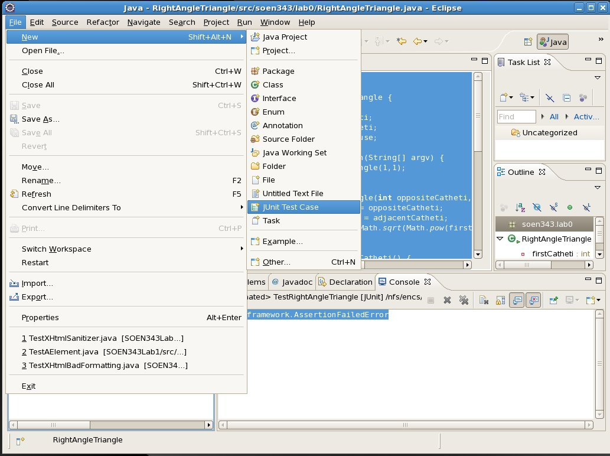

Writing Unit Tests With JUnit
=============================

Writing Unit Tests in JUnit is easy; all you need to do is extend `junit.framework.TestCase` and prefix methods with `test`.

For the sake of example, we’re going to work with a class called `RightAngleTriangle`:

Class Under Test: `RightAngleTriangle`
--------------------------------------

    package soen343.lab0;
    	
    public class RightAngleTriangle {
    	
    	private int firstCatheti;
    	private int secondCatheti;
    	private double hypotenuse;
    	
    	public static void main(String[] argv) {
    		new RightAngleTriangle(1,1);
    	}
    	
    	public RightAngleTriangle(int oppositeCatheti, int adjacentCatheti) {
    		this.firstCatheti = oppositeCatheti;
    		this.secondCatheti = adjacentCatheti;
    		this.hypotenuse = Math.sqrt(Math.pow(firstCatheti,2) + Math.pow(secondCatheti,2));
    	}
    	
    	public RightAngleTriangle(double oppositeCatheti, double adjacentCatheti) {
    		this.firstCatheti = oppositeCatheti;
    		this.secondCatheti = adjacentCatheti;
    		this.hypotenuse = Math.sqrt(Math.pow(firstCatheti,2) + Math.pow(secondCatheti,2));
    	}
    	
    	public double getFirstCatheti() {
    		return firstCatheti;
    	}
    	
    	public double getSecondCatheti() {
    		return secondCatheti;
    	}
    	
    	public double getHypotenuse() {
    		return hypotenuse;
    	}
    	
    	public void setHypotenuse(double hypotenuse) {
    		this.hypotenuse = hypotenuse;
    	}
    	
    	public double getFirstAngle() {
    		return Math.atan(secondCatheti/firstCatheti);
    	}
    	
    	public double getSecondAngle() {
    		return Math.atan(firstCatheti/secondCatheti);
    	}
    	
    }

`RightAngleTriangle` will be the _class under test_ meaning it is the class for which we are writing/running unit tests.

We are going to use some high school trigonomitry to test this class; you might want to give the Wikipedia article on [Trig functions](http://en.wikipedia.org/wiki/Trigonometric_functions) a once over, or at least leave it open in another window.

Writing a Test Case For Class `RightAngleTriangle`
--------------------------------------------------

With JUnit, you create a Test Case by writing a normal class like any other, and extending `junit.framework.TestCase`:

    import junit.framework.TestCase;
    	
    public class TestRightAngleTriangle extends TestCase { }

When you do it this way you’ll have to add the JUnit libraries to your build path.

Alternately, you can create a new JUnit test via Eclipse, using `File > New > JUnit Test Case`

You now have a test case, but no tests. Tests are created by prefixing a method with `test` like so:

    import junit.framework.TestCase;
    	
    public class TestRightAngleTriangle extends TestCase {
    	
    	public void testGetHypotenuse() {
    		// This is now a test!
    	}
    	
    }

This test does nothing yet though; what we want it to do is test the functionality of the `getHypotenuse()` method of class `TestRightAngleTriangle`.

So first we need an instance of `TestRightAngleTriangle`:

    	public void testGetHypotenuse() {
    		RightAngleTriangle triangle = new RightAngleTriangle(1, 1);
    	}

The `RightAngleTriangle` I’ve instantiated has sides of 1 unit; this is called a [45-45-90 triangle](http://en.wikipedia.org/wiki/Special_right_triangles#45-45-90_triangle) and its hypotenuse should therefore have a length equal to the square root of 2.

    	public void testGetHypotenuse() {
    		RightAngleTriangle triangle = new RightAngleTriangle(1, 1);
    		double expected = 1.4142135623730951;
    		double actual = triangle.getHypotenuse();
    	}

… but we’re _still_ not _testing_ anthing; in JUnit we actually _test_ with [JUnit asserts](http://www.junit.org/apidocs/org/junit/Assert.html). In this case we’re going to use `assertEuals` to make sure that `expected` and `actual` are equal.

    	public void testGetHypotenuse() {
    		RightAngleTriangle triangle = new RightAngleTriangle(1, 1);
    		double expected = 1.4142135623730951;
    		double actual = triangle.getHypotenuse();
    		assertEquals("Hypotenuse should be root 2", expected, actual);
    	}

You have now written your first Unit Test! (woot!)

Running Your Unit Test
----------------------

You can run all tests in the Test Case by simply selecting to `Run As > JUnit Test`

When you run your JUnit Test, the JUnit view will become visible (either on the left or the bottom or the right of your Eclipse workbench):

If all tests in your Test Case passed (or rather, did no fail) you will have a green bar, usually referred to as "The Green Bar." This is good; mthe goal is to always have a green bar.

If any of your tests have failed you will have a red bar, usually referred to as "The Red Bar." This is bad.

Elaborating on Your Test Case
-----------------------------

There are other methods in class `RightAngleTriangle` which aren’t being tested (this is bad) so we’re going to write more tests.

A clever student might realize there is a lot wrong with our test above and that it is pretty weak as far as quality unit tests go. This tutorial is only about how to write unit tests with JUnit; how to write _quality_ unit tests comes next week.

This is where some trig comes in; we’re going to double check that the calculations for the angles of the triangle are consistent with what our high-school math tells us they should be.

    package soen343.lab0.test;
    	
    import soen343.lab0.RightAngleTriangle;
    import junit.framework.TestCase;
    	
    public class TestRightAngleTriangle extends TestCase {
    	
    	public void testGetHypotenuse() {
    		RightAngleTriangle triangle = new RightAngleTriangle(1, 1);
    		double expected = 1.4142135623730951;
    		double actual = triangle.getHypotenuse();
    		assertEquals("Hypotenuse should be root 2", expected, actual);
    	}
    	
    	public void testGetFirstAngle() {
    		RightAngleTriangle triangle = new RightAngleTriangle(5, 6);
    		
    		double expected = Math.atan(6d/5d);
    		double actual = triangle.getFirstAngle();
    		
    		assertEquals("Actual first angle " + actual + " was inconsistent with expected angle " + expected, expected, actual);
    	}
    	
    	public void testGetSecondAngle() {
    		RightAngleTriangle triangle = new RightAngleTriangle(5, 6);
    		
    		double expected = Math.atan(5d/6d);
    		double actual = triangle.getSecondAngle();
    		
    		assertEquals("Actual second angle " + actual + " was inconsistent with expected angle " + expected, expected, actual);
    	}
    	
    }

This time when you run your test, it should fail; there is a bug in the `RightAngleTriangle` class… but I’ll let you figure that out. I’m going to focus on the failed tests.

It should be noted that execution stops when the test fails as JUnit throws a `junit.framework.AssertionFailedError`.

In your JUnit View you can expand the test case to see _exactly_ which test failed:

Double click on one of the failed exceptions and you will be able to see a "Failure Trace" – it will seem similar to when your application crashes due to a run-time exception. You can click on any item in the Failure Trace to move through the code and see exactly where execution stopped.
