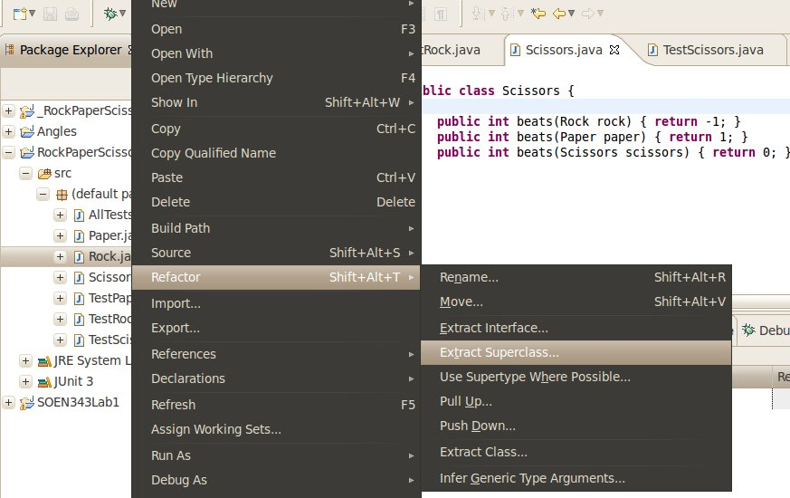
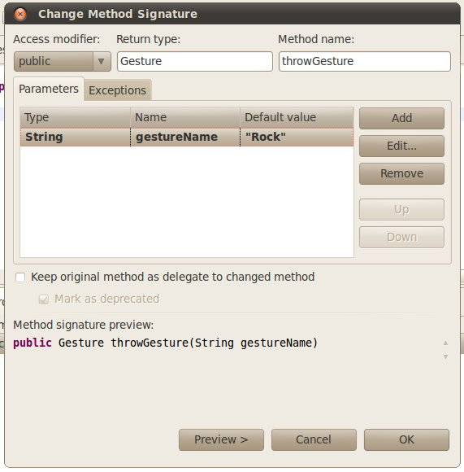

Developing a Rock Paper Scissors Game With TDD: Now With Refactoring
====================================================================

So you’ve gone through with several cycles of TDD and come up with classes and Test Cases and a Test Suite for a basic Rock Paper Scissors game.

Now you need to do some basic refactoring.

What is Refactoring?
--------------------

According to [refactoring.com](http://www.refactoring.com/):

> Refactoring is a disciplined technique for restructuring an existing body of code, altering its internal structure without changing its external behavior. Its heart is a series of small behavior preserving transformations. Each transformation (called a ‘refactoring’) does little, but a sequence of transformations can produce a significant restructuring. Since each refactoring is small, it’s less likely to go wrong. The system is also kept fully working after each small refactoring, reducing the chances that a system can get seriously broken during the restructuring.

Just like Design Patterns, refactorings have names so we can communicate about them more effectively.

You can find a [full list of Refactorings on refactoring.com](http://www.refactoring.com/catalog/index.html) and read about them in detail in Martin Fowler’s book [Refactoring](http://books.google.ca/books?id=KE-zdnHQehYC&printsec=frontcover&dq=refactoring&hl=en&ei=QJ6aTL_YKYSKlweOwqTpCQ&sa=X&oi=book_result&ct=result&resnum=3&ved=0CDcQ6AEwAg#v=onepage&q&f=false).

Remember that refactoring is about "altering its internal structure without changing its external behavior" so if all tests pass before the refactoring, all tests must also pass after, or its not refactoring, [it’s something else](http://www.scribd.com/doc/3236733/Refuctoring).

Refactoring: [Extract Superclass](http://www.refactoring.com/catalog/extractSuperclass.html)
--------------------------------------------------------------------------------------------

First, your `Rock` `Paper` and `Scissors` classes have a lot of similarities: they have so much in common, both in code (identical methods) and in terms of business logic (they are all gestures, according to the [Wikipedia entry on Rock Paper Scissors](http://en.wikipedia.org/wiki/Rock_paper_scissors#Game_play)) so we want to perform an [Extract Superclass](http://www.refactoring.com/catalog/extractSuperclass.html) refactoring on them.

In the Eclipse Package Explorer, right-click on one of those classes (I right clicked on `Rock`) and select `Refactor > Extract Superclass`:

In the new window, under &uuot;Specify actions for members" select the three `beats(…)` methods, and Set the Action as "declare abstract in superclass". This means we’re creating an abstract superclass, which will declare those methods.

Then, under "Types to extract the superclass from:" click on "Add" and add the other classes (`Rock`, `Paper` and `Scissors`) to the list.

Do _not_ check "Use the extracted class where possible". If it is checked, un-check it.

Specify a name for the new superclass, `Gesture` and click "Finish".

You’ll see a new class created, which `Rock`, `Paper` and `Scissors` all extend.

Run all tests; they should still pass. We’ll now continue with development.

TDD Step 5.1 – Write a Test
---------------------------

Write a new TestCase; call it `TestPlayer` and give it one method, `testThrowRock`:

    public class TestPlayer extends TestCase {
    	
    	public void testThrowRock() {
    		Player techN9ne = new Player();
    		Gesture rock = techN9ne.throwRock();
    		assertTrue(rock instanceof Rock);
    	}
    	
    }

Again, it should not compile.

TDD Step 5.2 – Run all tests and see if the new one fails
---------------------------------------------------------

The Test Case won’t even compile, let alone pass, as there is no class `Player`, so the test fails and we continue to writing code.

TDD Step 5.3 – Write some code to make the test pass
----------------------------------------------------

Create a class `Player`, and give it a method `throwRock()`:

    public class Player {
    	
    	public Gesture throwRock() {
    		return new Rock();
    	}
    	
    }

TDD Step 5.4 – Run all tests again
----------------------------------

Get the green bar!

TDD Step 3.5 – Refactor
-----------------------

None needed yet.

TDD Step 6.X – Repeat the above for Rock, Paper and Scissors
------------------------------------------------------------

You want your test case to look something like this:

    public class TestPlayer extends TestCase {
    	
    	public void testThrowRock() {
    		Player techN9ne = new Player();
    		Gesture rock = techN9ne.throwRock();
    		assertTrue(rock instanceof Rock);
    	}
    	
    	public void testThrowPaper() {
    		Player techN9ne = new Player();
    		Gesture paper = techN9ne.throwPaper();
    		assertTrue(paper instanceof Paper);
    	}
    	
    	public void testThrowScissors() {
    		Player techN9ne = new Player();
    		Gesture scissors = techN9ne.throwScissors();
    		assertTrue(scissors instanceof Scissors);
    	}
    	
    }

… at which point we’re ready for more refactoring.

Refactoring: [Parameterize Method](http://www.refactoring.com/catalog/parameterizeMethod.html)
----------------------------------------------------------------------------------------------

Class `Player` now has three similar methods – `throwRock`, `throwPaper` and `throwScissors` – which return the same type.

Having different methods like this doesn’t lend itself to scaling the system; if we (later) are asked to [add Lizard and Spock](http://en.wikipedia.org/wiki/Rock_paper_scissors#Additional_weapons) to the playable gestures it will require that we add new methods to class `Player` – `throwLizard()` and `throwSpock()`.

Instead, this should be one parameterized method, so we’re going to apply the [Parameterize Method](http://www.refactoring.com/catalog/parameterizeMethod.html) refactoring to address the issue.

The bad news is Eclipse won’t do this one for you; you’ll have to do it step by step.

First, change the name of one of the methods to `throwGesture` by right clicking on the method name, and selecting `Refactor > Rename`.

Then change the method signature; we need to add a String parameter.

Call it `gestureName` and make its default value the name of the gesture, with quotations – so when refactoring method `throwRock` the default value will be `"Rock"`, when refactoring method `throwPaper` the default value will be `"Paper"` and when refactoring method `throwScissors` the default value will be `"Scissors"`.

If you get an error message about `Duplicate method throwGesture(String) in Player`, click ‘Continue’ and don’t worry – it’s a good sign that you’re doing everything right.

Once you’ve done this to all three methods, class Player should have a bunch of build errors and look like this:

    public class Player {
    	
    	public Gesture throwGesture(String gestureName) {
    		return new Rock();
    	}
    	
    	public Gesture throwGesture(String gestureName) {
    		return new Paper();
    	}
    	
    	public Gesture throwGesture(String gestureName) {
    		return new Scissors();
    	}
    	
    }

Consolidate those three methods like so:

    public class Player {
    	
    	public Gesture throwGesture(String gestureName) throws Exception {
    		if("Rock".equals(gestureName)) {
    			return new Rock();
    		}
    		else if("Paper".equals(gestureName)) {
    			return new Paper();
    		}
    		else if("Scissors".equals(gestureName)) {
    			return new Scissors();
    		}
    		else {
    			throw new Exception("Not a valid Gesture name");
    		}
    	}
    	
    }

Run all your tests again; all you should see is green.

Refactoring: [Replace Constructor with Factory Method](http://www.refactoring.com/catalog/replaceConstructorWithFactoryMethod.html)
-----------------------------------------------------------------------------------------------------------------------------------

We can take this a step further and subject class `Gesture` to a [Replace Constructor with Factory Method](http://www.refactoring.com/catalog/replaceConstructorWithFactoryMethod.html) refactoring, by making its constructor protected and writing a method `newGesture(String)` which uses [reflection](http://java.sun.com/developer/technicalArticles/ALT/Reflection/):

    	public static Gesture newGesture(String gestureName) throws Exception {
    		try {
    			Class gestureClass = Class.forName(gestureName);
    			if(Gesture.class.isAssignableFrom(gestureClass)) {
    				Object newObject = gestureClass.newInstance();
    				return (Gesture) newObject;
    			}
    		}
    		catch(Exception e) {
    			throw new Exception("Not a valid Gesture name", e);			
    		}
    		throw new Exception("Not a valid Gesture name");
    	}

We can now simplify `Player.throwGesture(String)` to be one line:

    	public Gesture throwGesture(String gestureName) throws Exception {
    		return Gesture.newGesture(gestureName);
    	}

Run your tests; if they pass, you’re now ready to test the interaction between two players.

TDD Step 7.1 – Write a Test
---------------------------

Now we’re going to test how two players interact:

    	public void testPaperBeatsRock() throws Exception {
    		Player player1 = new Player();
    		Player player2 = new Player();
    		Gesture paper = player1.throwGesture("Paper");
    		Gesture rock = player2.throwGesture("Rock");
    		
    		assertTrue(paper.beats(rock)>0);
    	}

Whether this is still _unit testing_ is something the academics might argue over – since we have two players – but the focus of this tutorial is TDD, not unit testing. So it’s a test and that’s good enough for now.

This tests won’t compile though: Eclipse will tell you that `The method beats(Rock) in the type Gesture is not applicable for the arguments (Gesture)`.

TDD Step 7.2 – Run all tests and see if the new one fails
---------------------------------------------------------

Since the tests won’t compile, we can’t run it and it fails implicitly.

TDD Step 7.3 – Write some code to make the test pass
----------------------------------------------------

Our variables `paper` and `rock` are declared of type `Gesture`, so they can’t be passed to any of the methods in class `Gesture` – which expects a `Rock`, `Paper` or `Scissors` object.

One student suggested adding a `beats(Gesture)` method to class `Gesture`, like so:

**The following is a fail:**

    	public int beats(Gesture g) {
    		throw new RuntimeException("I didn't think this would ever get called!");
    	}

… suggesting that – since the runtime type of a Gesture will always be `Rock`, `Paper` or `Scissors`, the method `beats(Gesture)` will never get called and the compiler will be happy.

This is not the case though. If you add that method, your test fails.

### The Problem: Overloading in Java and Compile-Time Binding

In Java, overriding is always bound at runtime, but overloading is a little more complicated: dynamic dispatching means that the implementation of a method will be chosen at runtime, but the method’s **signature** is nonetheless determined at compile time. (Don’t believe me? Check out the [Java Language Specification, Chapter 8.4.9](http://java.sun.com/docs/books/jls/third_edition/html/classes.html#8.4.9)!)

You can understand the source of the problem better if we cast `rock` to `Gesture` like so:

    	public void testPaperBeatsRock() throws Exception {
    		Player player1 = new Player();
    		Player player2 = new Player();
    		Gesture paper = player1.throwGesture("Paper");
    		Gesture rock = player2.throwGesture("Rock");
    		
    		assertTrue(paper.beats((Gestuer)rock)>0); // obviously call beats(Gesture)
    	}

… but since `rock` is declared of type `Gesture` this is superfluous! Either way – with or without a cast – so long as the _declared type_ of `rock` is `Gesture`, the method with signature `beats(Gesture)` is called. Were [Joshua Bloch](http://en.wikipedia.org/wiki/Joshua_Bloch) explaining this, he would warn you that **overloadings represent opportunities for error and confusion**.

For more on the confusion of overloading, see the puzzler "Making a Hash of It" on page 137 of the book [Java Puzzlers](http://www.javapuzzlers.com/).

### The Solution

The solution is to use a slightly confusing mix of method overloading and method overriding.

Add `beats(Gesture)` as an _abstract_ method to class `Gesture`:

    	public abstract Gesture beats(Gesture gesture);

… and implement it in each subclass as follows:

    	public int beats(Gesture gesture) {
    		return gesture.beats(this);
    	}

The key is that the variable `this` has a declared type which is consistent with the runtime type. In class `Rock` the compiler sees:

    	public int beats(Gesture gesture) {
    		return gesture.beats((Rock)this);
    	}

… while, in class `Paper` the compiler sees:

    	public int beats(Gesture gesture) {
    		return gesture.beats((Paper)this);
    	}

… while, in class `Scissors` the compiler sees:

    	public int beats(Gesture gesture) {
    		return gesture.beats((Scissors)this);
    	}

… and now all your tests should pass, and you’ll be ready to write a proper driver for your Rock Paper Scissors game.
