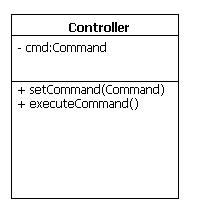

More On Implementing The Command Pattern
========================================

Last week in tutorial, one student asked why we didn’t use the Controller as the Client in our implementation of the Command Pattern. In this tutorial I’m going to point out some smells which we had in that implementation of Command, and go over an alternate implementation which will use the Controller as the Client, but will have shortcomings of its own.

Code Smells from [Last Week’s Command Pattern](tut-61.the-command-pattern.md)
----------------------------------------------------------------------------------------------------

Several students pointed out some code smells in our implementation last week. The first and most prominent was that it implied creating multiple instances of `Controller` – one for each an every `SetTaskStatusButton` which was instantiated.

    package soen343.commandpatternexample.presentation;
    	
    public class SetTaskStatusButton extends JButton {
    	
    	public SetTaskStatusButton(Task task, boolean newStatus) {
    		super("Set task " + task.getId() + " to "  + (newStatus?"done":"not done"));
    		Command command = new SetTaskStatus(task, newStatus);
    	
    		final Controller controller = new Controller();
    			// So every time we create a new instance of `SetTaskStatusButton`
    			// we create a *new* Controller?
    	
    		controller.setCommand(command);
    		this.addActionListener(new ActionListener() {
    				public void actionPerformed(ActionEvent e) {
    					controller.executeCommand();
    				}
    			}
    		);
    	}
    }

On top of having multiple instances of `Controller` floating around in memory, our `Controller` class doesn’t look anything like Larman’s description of the two kinds of GRASP Controllers: (from "Applying UML and Patterns")

> Assign the responsibility to an object representing one of these choices:
> 
> *   Represents the overall "system," a "root object," a device that the software is running within, or a major subsystem (these are all variations of a _facade controller_).
> *   Represents a use case scenario within which the system operation occurs (a use-case or _session controller_)

Look at the UML diagram for the Controller we wrote last week. Does it look anything like either a _facade controller_ or a _use case controller_?

It doesn’t sem to have anything to do with the idea of a _facade controller_ or a _use case controller_ – now it just looks like an invoker, not a Controller at all.

So how can we get back to Controllers which serve as a facade or a use case? Before the Controller(s) had methods for each system operation for a given Use Case:

Suggestion: Implement a Controller Which is used as both Invoker, and Client
----------------------------------------------------------------------------

It could be worthwhile to write up classes like the ones in the above class diagram, which you could then use as the Invoker _and_ as the Client in your Command Pattern implementation.

These Controller classes could have a method for each system operation, and would delegate to Command objects:

    public class ManageTasksController extends Controller {
    	
    	public void changeTaskStatus(Task t, boolean status) {
    		SetTaskStatus command = new SetTaskStatus(t, status);
    		// by leaving the implementation of
    		// `setCommand(…)` and `executeCommand()`
    		// in the parent class, there is still
    		// some division between the part of this object which is
    		// Client and which is Invoker
    		this.setCommand(command);
    		this.executeCommand();
    	}
    	
    	public void addTask(Task t) { /* ... */ }
    	public void deleteTask(Task t) { /* ... */ }
    	
    }

The Down Side(s)
----------------

If you use this implementation, you’re preserving the intent of a GRASP Controller, but you have to ask yourself if this couples the Controller to the generalizations of `Command`: we basically have a method for each Command. Every time we add a command, does this mean we’ll have to add a new method to the Controller class(es)? On the other hand, does this implementation communicate intent more? Is it easier to understand and thus to maintain?

Additionally, this hasn’t solved the problem of having multiple instances of the Controller class(es) floating around in memory… [at least not yet](http://en.wikipedia.org/wiki/Singleton_pattern).
