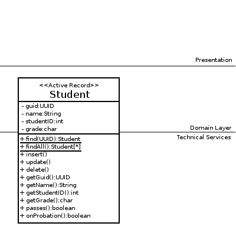

Implementing the Active Record Pattern
======================================

This tutorial assumes you did the [Row Data Gateway tutorial](tut-71.implementing-row-data-gateway.md).

An [Active Record](http://martinfowler.com/eaaCatalog/activeRecord.html) looks a lot like a [Row Data Gateway](http://martinfowler.com/eaaCatalog/rowDataGateway.html), but with one difference; an Active Record contains domain logic.

As an example, imagine we needed some methods to the StudentGateway to determine if a student has a passing grade or if they’re on probation:

    	public boolean passes() {
    		return grade!='F';
    	}
    	public boolean onProbation() {	// a grade of D or F
    					// results in being put on probation…
    		return grade>='D';
    	}

Adding these to the `StudentGateway` class results in domain logic residing in the RDG, and as a consequence, it is no longer a Row Data Gateway; it is now an implementation of the Active Record pattern.

An Example (Code)
-----------------

    /* Active Record */
    public class Student {
    	
    	private final UUID guid;
    	private int studentID;
    	private String name;
    	private char grade;
    	
    	public Student() {
    		this.guid = UUID.randomUUId();
    	}
    	
    	public Student(UUID guid) {
    		this.guid = guid;
    	}
    	
    	/***************************************************************
    	 *  Getters and Setters
    	 ***************************************************************/
    	
    	public int getStudentId() {
    		return studentID;
    	}
    	
    	public void setStudentId(int studentID) {
    		this.studentID = studentID;
    	}
    	
    	public String getName() {
    		return name;
    	}
    	
    	public void setName(String name) {
    		this.name = name;
    	}
    	
    	public char getGrade() {
    		return grade;
    	}
    	
    	public void setGrade(char grade) {
    		this.grade = grade;
    	}
    	
    	public UUID getGuId() {
    		return guid;
    	}
    	
    	/***************************************************************
    	 *  Domain Logic Methods
    	 ***************************************************************/
    	
    	public boolean passes() {
    		return grade!='F';
    	}
    	
    	public boolean onProbation() {	// a grade of D or F
    					// results in being put on probation…
    		return grade<'D';
    	}
    	
    	/***************************************************************
    	 *  SQL Operation Methods
    	 ***************************************************************/
    	
    	public synchronized static Student findByGuId(UUID uniqueID) throws ActiveRecordException {
    		try {
    			Connection db =	/* You need an object which is responsible for opening and closing connections */
    					/* see slide #9 of "Topic 07b: Data Source Patterns" */
    	
    			String statement = "SELECT `guid`, `grade`, `studentID`, `name` FROM `students` where `guid`=?";
    			PreparedStatement dbStatement = db.prepareStatement(statement);
    			dbStatement.setString(1, uniqueID.toString());
    			ResultSet rs = dbStatement.executeQuery();
    			
    			while(rs.next()) {
    				UUID guid = UUID.fromString(rs.getString("guid"));
    				String name = rs.getString("name");
    				char grade = rs.getString("grade").charAt(0);
    				int studentID = rs.getInt("studentID");
    				
    				Student student = new Student(guid);
    				student.name = name;
    				student.grade = grade;
    				student.studentID = studentID;
    				
    				return student;
    			}
    			return null;
    			
    		} catch (SQLException e) {
    			// We don't want any types which use the Active Record
    			// to be coupled to java.sql.SQLException
    			// So instead, we throw a custom ActiveRecordException 
    			throw new ActiveRecordException("Error occured reading Students from the data source.", e);
    		}
    	}
    	
    	public synchronized void update() throws ActiveRecordException {
    		try {
    			Connection db =	/* You need an object which is responsible for opening and closing connections */
    					/* see slide #9 of "Topic 07b: Data Source Patterns" */
    	
    			String statement = "UPDATE `students` SET `grade`=?, `studentID`=?, `name`=? where `guid`=?";
    			PreparedStatement dbStatement = db.prepareStatement(statement);
    			dbStatement.setString(1, Character.toString(this.grade));
    			dbStatement.setInt(2, this.studentID);
    			dbStatement.setString(3, this.name);
    			dbStatement.setString(4, this.guid.toString());
    			dbStatement.executeUpdate();
    			
    		} catch (SQLException e) {
    			// We don't want any types which use the Active Record
    			// to be coupled to java.sql.SQLException
    			// So instead, we throw a custom ActiveRecordException 
    			throw new ActiveRecordException("Error occured reading Students from the data source.", e);
    		}
    	}
    	
    	public synchronized void insert() throws ActiveRecordException {
    		try {
    			Connection db =	/* You need an object which is responsible for opening and closing connections */
    					/* see slide #9 of "Topic 07b: Data Source Patterns" */
    	
    			String statement = "INSERT INTO `students` (`grade`, `studentID`, `name`, `guid`) VALUES (?, ?, ?, ?)";
    			PreparedStatement dbStatement = db.prepareStatement(statement);
    			dbStatement.setString(1, Character.toString(this.grade));
    			dbStatement.setInt(2, this.studentID);
    			dbStatement.setString(3, this.name);
    			dbStatement.setString(4, this.guid.toString());
    			dbStatement.executeUpdate();
    			
    		} catch (SQLException e) {
    			// We don't want any types which use the Active Record
    			// to be coupled to java.sql.SQLException
    			// So instead, we throw a custom ActiveRecordException 
    			throw new ActiveRecordException("Error occured reading Students from the data source.", e);
    		}
    	}
    	
    	public synchronized void delete() throws ActiveRecordException {
    		try {
    			Connection db =	/* You need an object which is responsible for opening and closing connections */
    					/* see slide #9 of "Topic 07b: Data Source Patterns" */
    	
    			String statement = "DELETE FROM `students` where `guid`=?";
    			PreparedStatement dbStatement = db.prepareStatement(statement);
    			dbStatement.setString(1, this.guid.toString());
    			dbStatement.executeUpdate();
    			
    		} catch (SQLException e) {
    			// We don't want any types which use the Active Record
    			// to be coupled to java.sql.SQLException
    			// So instead, we throw a custom ActiveRecordException 
    			throw new ActiveRecordException("Error occured reading Students from the data source.", e);
    		}
    	}
    	
    }

Active Record In Your Application
---------------------------------

Active Record has a problem though; it has responsibilities which span both the Domain Layer and the Technical Services Layer:

*   It represents a _Domain_ Model Object, implementing both its behavior and its data attributes
*   It deals with SQL and persists data to the database

This is less than ideal, and results in the Active Record object residing in _both_ the Domain Layer and the Technical Services Layer.

So while Active Record is a great data source pattern for small to medium sized applications which are heavily database driven ([you can see it in action in the Ruby on Rails world](http://api.rubyonrails.org/classes/ActiveRecord/Base.html)) it is fundamentally incohesive, and could benefit from some refactoring to separate its responsibilities into a [Domain Model Object and a Data Mapper](tut-73.implementing-data-mapper.md).
