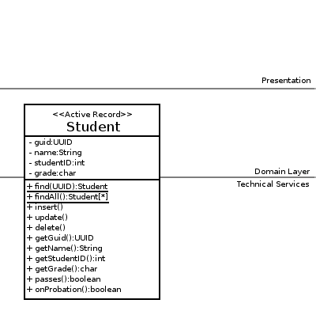
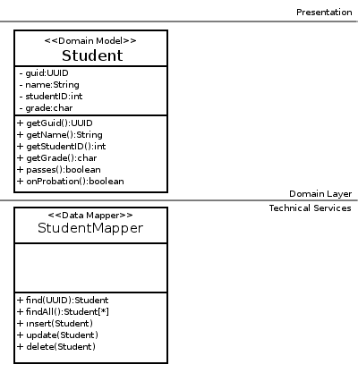
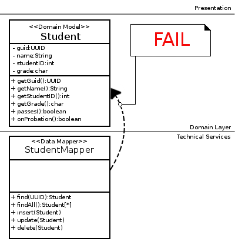

Implementing the Data Mapper Pattern
====================================

This tutorial assumes you did the [Row Data Gateway tutorial](tut-71.implementing-row-data-gateway.md) and the [Active Record tutorial](tut-72.implementing-active-record.md).

So we’ve examined Active Record, and come to the conclusion that it should be re-designed into separate classes because it has responsibilities in both the Domain Layer and in the Technical Services layer.

The solution is to split the Active Record into two classes:

*   A Domain Model Object
*   A Data Mapper Object, which is responsible for reading from the database and creating instances of the Domain Model

An Example (Code)
-----------------

Take all those SQL operation methods and put them in a new class `StudentDataMapper`. Replace any reference to `this` with a parameter of type `domain.Student`:

    package technicalservices;
    	
    public class StudentDataMapper {
    	
    	public static synchronized Student findByGuId(UUID uniqueID) throws DataMapper {
    		try {
    			Connection db =	/* You need an object which is responsible for opening and closing connections */
    					/* see slide #9 of "Topic 07b: Data Source Patterns" */
    	
    			String statement = "SELECT `guid`, `grade`, `studentID`, `name` FROM `students` where `guid`=?";
    			PreparedStatement dbStatement = db.prepareStatement(statement);
    			dbStatement.setString(1, uniqueID.toString());
    			ResultSet rs = dbStatement.executeQuery();
    			
    			while(rs.next()) {
    				UUID guid = UUID.fromString(rs.getString("guid"));
    				String name = rs.getString("name");
    				char grade = rs.getString("grade").charAt(0);
    				int studentID = rs.getInt("studentID");
    				
    				Student student = new Student(guid);
    				// careful with these setters once you've written code for state!
    				student.setName(name);
    				student.setGrade(grade);
    				student.setStudentId(studentID);
    				
    				return student;
    			}
    			return null;
    			
    		} catch (SQLException e) {
    			// We don't want any types which use the Data Mapper
    			// to be coupled to java.sql.SQLException
    			// So instead, we throw a custom DataMapperException 
    			throw new DataMapperException("Error occured reading Students from the data source.", e);
    		}
    	}
    	
    	public synchronized void update(Student student) throws DataMapper {
    		try {
    			Connection db =	/* You need an object which is responsible for opening and closing connections */
    					/* see slide #9 of "Topic 07b: Data Source Patterns" */
    	
    			String statement = "UPDATE `students` SET `grade`=?, `studentID`=?, `name`=? where `guid`=?";
    			PreparedStatement dbStatement = db.prepareStatement(statement);
    			dbStatement.setString(1, Character.toString(student.getGrade()));
    			dbStatement.setInt(2, student.getStudentId());
    			dbStatement.setString(3, student.getName());
    			dbStatement.setString(4, student.getGuId().toString());
    			dbStatement.executeUpdate();
    			
    		} catch (SQLException e) {
    			// We don't want any types which use the Data Mapper
    			// to be coupled to java.sql.SQLException
    			// So instead, we throw a custom DataMapperException 
    			throw new DataMapperException("Error occured reading Students from the data source.", e);
    		}
    	}
    	
    	public synchronized void insert(Student student) throws DataMapper {
    		try {
    			Connection db =	/* You need an object which is responsible for opening and closing connections */
    					/* see slide #9 of "Topic 07b: Data Source Patterns" */
    	
    			String statement = "INSERT INTO `students` (`grade`, `studentID`, `name`, `guid`) VALUES (?, ?, ?, ?)";
    			PreparedStatement dbStatement = db.prepareStatement(statement);
    			dbStatement.setString(1, Character.toString(student.getGrade()));
    			dbStatement.setInt(2, student.getStudentId());
    			dbStatement.setString(3, student.getName());
    			dbStatement.setString(4, student.getGuId().toString());
    			dbStatement.executeUpdate();
    			
    		} catch (SQLException e) {
    			// We don't want any types which use the Data Mapper
    			// to be coupled to java.sql.SQLException
    			// So instead, we throw a custom DataMapperException 
    			throw new DataMapperException("Error occured reading Students from the data source.", e);
    		}
    	}
    	
    	public synchronized void delete(Student student) throws DataMapper {
    		try {
    			Connection db =	/* You need an object which is responsible for opening and closing connections */
    					/* see slide #9 of "Topic 07b: Data Source Patterns" */
    	
    			String statement = "DELETE FROM `students` where `guid`=?";
    			PreparedStatement dbStatement = db.prepareStatement(statement);
    			dbStatement.setString(1, student.getGuId().toString());
    			dbStatement.executeUpdate();
    			
    		} catch (SQLException e) {
    			// We don't want any types which use the Data Mapper
    			// to be coupled to java.sql.SQLException
    			// So instead, we throw a custom DataMapperException 
    			throw new DataMapperException("Error occured reading Students from the data source.", e);
    		}
    	}
    }

… leaving behind your Domain Model object in `Student`:

    package domain;
    	
    public class Student {
    	
    	private final UUID guid;
    	private int studentID;
    	private String name;
    	private char grade;
    	
    	public Student() {
    		this.guid = UUID.randomUUId();
    	}
    	
    	public Student(UUID guid) {
    		this.guid = guid;
    	}
    	
    	/***************************************************************
    	 *  Getters and Setters
    	 ***************************************************************/
    	
    	public int getStudentId() {
    		return studentID;
    	}
    	
    	public void setStudentId(int studentID) {
    		this.studentID = studentID;
    	}
    	
    	public String getName() {
    		return name;
    	}
    	
    	public void setName(String name) {
    		this.name = name;
    	}
    	
    	public char getGrade() {
    		return grade;
    	}
    	
    	public void setGrade(char grade) {
    		this.grade = grade;
    	}
    	
    	public UUID getGuId() {
    		return guid;
    	}
    	
    	/***************************************************************
    	 *  Domain Logic Methods
    	 ***************************************************************/
    	
    	public boolean passes() {
    		return grade!='F';
    	}
    	
    	public boolean onProbation() {	// a grade of D or F
    					// results in being put on probation…
    		return grade<'D';
    	}
    	
    }

Data Mapper In Your Application
-------------------------------

There is a problem with putting Data Mapper in the Technical Services Layer, though; an attentive student would note that in the above UML diagram, there should be a dependency from the Data Mapper to the Domain Model object… an _upward_ dependency.

  
Do NOT do this

In order to fix this, you need your Data Mapper to be in the Domain layer… but so long as it’s coupled to the SQL (and the `java.sql` package) it can’t really go in the Domain Layer.

In order to solve this problem, we need to look at two more patterns; [Record Set and Table Data Gateway](tut-74.implementing-table-data-gateway.md).
